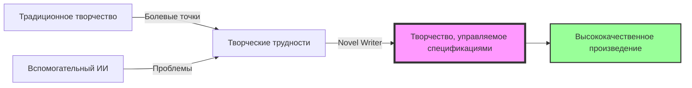
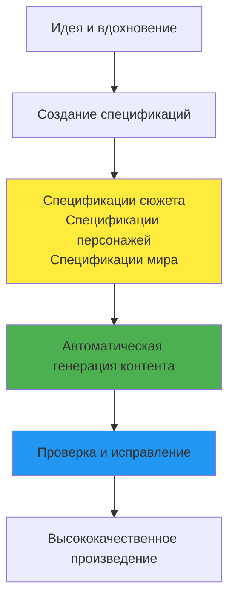
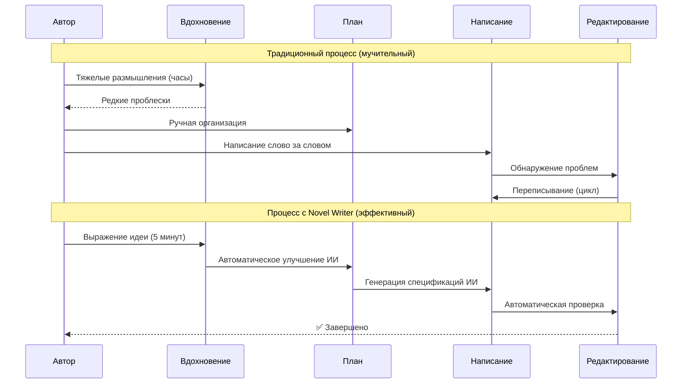
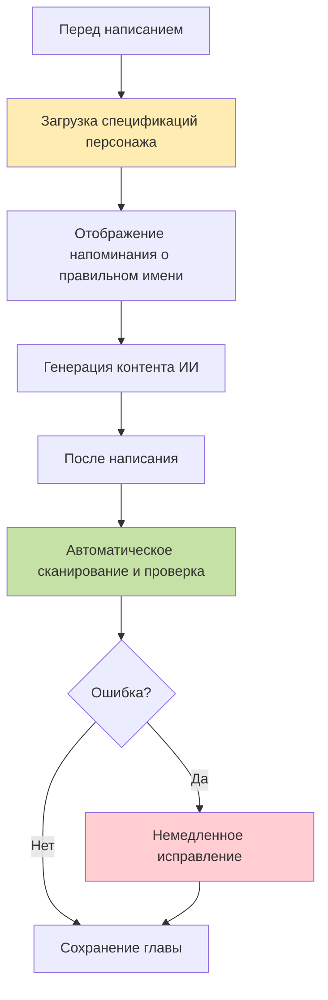
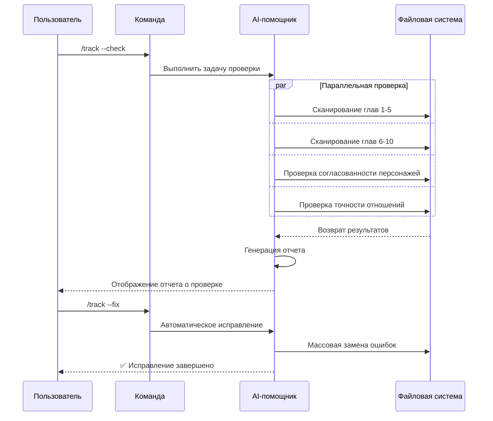

# Novel Writer: Полное руководство по написанию романов

> 🚀 От идеи до готового произведения: пусть ИИ станет вашим партнером по творчеству, а не заменой

## Оглавление

1. [Почему нужен Novel Writer?](#почему-нужен-novel-writer)
2. [Ключевая концепция: Творчество, управляемое спецификациями](#ключевая-концепция-творчество-управляемое-спецификациями)
3. [Быстрый старт: Напишите первую главу за 30 минут](#быстрый-старт-напишите-первую-главу-за-30-минут)
4. [Полный творческий процесс](#полный-творческий-процесс)
5. [Решение: Как избежать галлюцинаций ИИ](#решение-как-избежать-галлюцинаций-ии)
6. [Практические примеры](#практические-примеры)
7. [Продвинутые техники](#продвинутые-техники)
8. [Часто задаваемые вопросы](#часто-задаваемые-вопросы)

---

## Почему нужен Novel Writer?

### 5 основных болевых точек традиционного творчества

#### 😫 Болевая точка 1: Творческий кризис
**Проблема**: Не знаешь, как продолжить писать, вдохновение иссякло
```
Традиционный подход: Смотреть на экран в ступоре → Форсированно писать → Снижение качества → Удалить и переписать
Затраты времени: От нескольких часов до нескольких дней
```

#### 😵 Болевая точка 2: Потеря контроля над сюжетом
**Проблема**: Позже обнаруживаешь противоречия, забываешь про намеченные сюжетные линии
```
Традиционный подход: Перечитывать предыдущие части → Ручная запись → Все равно что-то упускаешь → Читатели находят баги
Влияние: Снижение рейтинга, потеря читателей
```

#### 💔 Болевая точка 3: Разрушение персонажей
**Проблема**: Характер персонажа непоследователен, диалоги не соответствуют его образу
```
Традиционный подход: Писать биографию персонажа → Все равно не запоминаешь → Персонаж теряет свою суть → Читатели жалуются
Последствия: Самая фатальная творческая авария
```

#### ⏰ Болевая точка 4: Давление обновлений
**Проблема**: Требование ежедневных обновлений, сложно совмещать качество и скорость
```
Традиционный подход: Писать до поздней ночи → Снижение качества → Порочный круг → Истощение физических и психических сил
Реальность: 70% авторов сдаются по этой причине
```

#### 📉 Болевая точка 5: Колебания качества
**Проблема**: Сильное влияние состояния на результат, качество произведения скачет
```
Традиционный подход: Писать в зависимости от состояния → То хорошо, то плохо → Плохой читательский опыт → Снижение числа постоянных читателей
Статистика: Средний процент потери подписчиков — 30%
```

### 3 основные проблемы вспомогательного ИИ-творчества

#### 🤖 Проблема 1: Галлюцинации ИИ
**Явление**: ИИ может внезапно изменить имя главного героя, сеттинг, отношения
```
Примеры:
- Главный герой Ли Мин внезапно стал Чжан Хуа
- В современном городском сеттинге внезапно появился элемент культивации
- Второстепенный персонаж внезапно воскрес
```

#### 🔀 Проблема 2: Отсутствие последовательности
**Явление**: Каждый раз генерация происходит независимо, невозможно поддерживать непрерывность истории
```
Проблемы:
- Разрывы в сюжете
- Персонажи теряют память
- Путаница в сеттинге
```

#### 🎨 Проблема 3: Несогласованность стиля
**Явление**: Стиль письма колеблется, как будто писал несколько человек
```
Проявления:
- То литературно, то простонародно
- То в древнем стиле, то современно
- Плохой читательский опыт
```

### Наше решение



| Пункт сравнения            | Традиционное творчество | Обычный вспомогательный ИИ | Novel Writer                    |
| -------------------------- | ----------------------- | -------------------------- | ------------------------------- |
| Иссякновение вдохновения   | ❌ Полагается на себя    | ⚠️ Случайная генерация      | ✅ Структурированное руководство |
| Управление сюжетом         | ❌ Ручная запись         | ❌ Нет памяти               | ✅ Автоматическое отслеживание   |
| Согласованность персонажей | ⚠️ Полагается на память  | ❌ Часто ошибается          | ✅ Система проверки              |
| Эффективность творчества   | ❌ 2000 слов/день        | ⚠️ Нестабильно              | ✅ 10000 слов/день               |
| Гарантия качества          | ⚠️ Зависит от состояния  | ❌ Неконтролируемо          | ✅ Гарантия спецификациями       |

---

## Ключевая концепция: Творчество, управляемое спецификациями

### Что такое управление спецификациями?

Представьте, что вы строите дом:
- **Традиционное письмо**: Строишь, думая на ходу, возможно, обнаружишь проблемы со структурой в середине строительства
- **Управление спецификациями**: Сначала создаешь чертеж, потом строишь, каждый шаг гарантирован



### Магия спецификаций

**Спецификации = Конституция творчества**

Подобно тому, как конституция ограничивает действия правительства, спецификации ограничивают генерацию ИИ:
- Если главного героя зовут Ли Чжунъюн, ИИ не напишет Ли Мин
- Если сеттинг — современный город, ИИ не добавит культивацию
- Если характер персонажа интровертный, ИИ не заставит его болтать без умолку

---

## Быстрый старт: Напишите первую главу за 30 минут

### Шаг 1: Установка (2 минуты)

```bash
# Установка Novel Writer
npm install -g novel-writer-ru

# Создайте свой проект романа
novel init my-first-novel
cd my-first-novel
```

### Шаг 2: Настройка стиля (3 минуты)

В AI-помощнике (Claude/Cursor) введите:

```
/constitution
Я хочу написать легкий и юмористический городской роман в стиле «крутого парня», главный герой должен быть умным, но не святым, темп должен быть быстрым, и каждая глава должна содержать «крутой момент».
```

Пример ответа ИИ:
```
✅ Стиль творчества настроен
- Тон: Легкий и юмористический
- Темп: Быстрый и динамичный
- Персонаж: Умный, не святой
- Особенность: «Крутой момент» в каждой главе
```

### Шаг 3: Создание истории (5 минут)

```
/specify
Обычный студент колледжа Линь Фань случайно получает «Систему сбора негативных эмоций».
Гнев, зависть, шок других людей могут превращаться в его очки атрибутов.
С этого момента он начинает жизнь крутого парня, специально раздражающего других.
```

ИИ поможет вам доработать это в полные спецификации истории, включая:
- Ключевые сеттинги
- Основные персонажи
- Система силы
- Основная сюжетная линия

### Шаг 4: Планирование глав (5 минут)

```
/plan 100 глав, разделенных на:
1. Период становления в кампусе (главы 1-30)
2. Период взлета в бизнесе (главы 31-60)
3. Период международных противостояний (главы 61-90)
4. Период пиковых сражений (главы 91-100)
```

### Шаг 5: Генерация задач (3 минуты)

```
/tasks
```

ИИ автоматически разделит это на конкретные задачи по написанию:
- Глава 1: Пробуждение системы, первое проявление силы
- Глава 2: Школьный хулиган, разгромлен в один прием
- Глава 3: Школьная красавица преследует, весь кампус в шоке
- ...

### Шаг 6: Начните писать (10 минут)

```
/write Глава 1: Пробуждение системы
```

ИИ сгенерирует контент первой главы на основе всех спецификаций.

### Шаг 7: Проверка качества (2 минуты)

```
/track --check
```

Автоматическая проверка:
- ✅ Имя главного героя совпадает
- ✅ Сеттинг системы соответствует
- ✅ Стиль легкий и юмористический
- ✅ Присутствует явный «крутой момент»

**🎉 Поздравляем! Ваша первая глава завершена!**

---

## Полный творческий процесс

### Традиционное творчество vs Творчество с Novel Writer



### Шестишаговый метод творчества подробно


#### Подробное описание

##### 1️⃣ Настройка стиля `/constitution`
- **Функция**: Установка тона творчества, как настройка тона для музыкальной группы
- **Ввод**: Ваши предпочтения в творчестве
- **Вывод**: Файл конституции творчества
- **Время**: 2 минуты

##### 2️⃣ Создание истории `/specify`
- **Функция**: Превращение расплывчатых идей в четкие сеттинги
- **Ввод**: Краткое изложение истории в одном предложении
- **Вывод**: Полные спецификации истории
- **Время**: 5 минут

##### 3️⃣ Планирование глав `/plan`
- **Функция**: Построение каркаса истории
- **Ввод**: Примерный план глав
- **Вывод**: Детальный план глав
- **Время**: 5 минут

##### 4️⃣ Генерация задач `/tasks`
- **Функция**: Превращение плана в выполнимые задачи
- **Ввод**: Автоматическое чтение плана
- **Вывод**: Список конкретных задач по написанию
- **Время**: 2 минуты

##### 5️⃣ Массовая генерация `/write`
- **Функция**: ИИ генерирует контент на основе спецификаций
- **Ввод**: Номер главы и заголовок
- **Вывод**: Полный контент главы
- **Время**: 10 минут на главу

##### 6️⃣ Проверка и исправление `/track`
- **Функция**: Обеспечение качества и согласованности
- **Ввод**: Написанные главы
- **Вывод**: Отчет о проверке и автоматические исправления
- **Время**: 5 минут / 10 глав

---

## Решение: Как избежать галлюцинаций ИИ

### Проблема: Имя главного героя меняется ИИ

#### ❌ Неправильный пример
```
Глава 1: Главного героя зовут Линь Фань
Глава 3: Внезапно стал Линь Фэн
Глава 5: Снова стал главным героем
```

#### ✅ Наше решение



### Принцип работы системы проверки

```json
// validation-rules.json
{
  "characters": {
    "protagonist": {
      "correct_names": ["Линь Фань", "Брат Фань"],
      "forbidden": ["Линь Фэн", "главный герой", "мужской протагонист"],
      "auto_fix": true
    }
  }
}
```

### Диаграмма последовательности массовой проверки



---

## Практические примеры

### Пример 1: Фэнтезийный роман «Ежедневные регистрации в течение 10 000 лет»

#### Предыстория проекта
- **Цель**: Написать фэнтезийный роман в стиле «крутого парня» объемом 300 000 слов
- **Требование**: Ежедневное обновление по 10 000 слов
- **Особенность**: Система ежедневных регистраций + стиль «непобедимый»

#### Процесс творчества

##### День 1: Запуск проекта (30 минут)
```bash
# 1. Инициализация
novel init sign-in-story

# 2. Настройка стиля
/constitution Роман в стиле «крутого парня», быстрый темп, частые «раздачи пощечин», главный герой непобедим, но не высокомерен

# 3. Создание истории
/specify
Е Чжэнь, путешествующий в мир фэнтези, получает систему ежедневных регистраций.
Другие усердно тренируются сотни лет, он становится сильнее с каждой регистрацией.
Тихо регистрируется в течение 10 000 лет, выходит из уединения непобедимым.

# 4. Планирование 300 глав
/plan 300 глав, разделенных на четыре этапа: деревня новичков, секта, империя, царство бессмертных

# 5. Генерация задач
/tasks
```

##### День 2-30: Ежедневное обновление по 10 000 слов
```bash
# Ежедневный рабочий процесс (1 час)
/write Глава 31: Великое соревнование секты
/write Глава 32: Мгновенное убийство одним ударом
/write Глава 33: Старейшины в шоке
/write Глава 34: Святая дева благоволит
/write Глава 35: Скрытая сила

# Проверка каждые 5 глав (2 минуты)
/track --check
/track --fix  # Автоматическое исправление
```

#### Результаты данных
- **Время завершения**: 30 дней
- **Общий объем**: 300 000 слов
- **Среднее время в день**: 1 час
- **Оценка качества**: 8.5/10
- **Отзывы читателей**: «Сюжет плавный, много «крутых моментов», очень приятно читать в режиме ожидания обновлений»

### Пример 2: Городской роман «Маленькая жена великого магната»

#### Предыстория проекта
- **Цель**: Городской роман объемом 200 000 слов
- **Требование**: Детальное описание эмоций
- **Особенность**: Сладкая любовь + легкая драма

#### Процесс творчества

##### Первоначальная настройка
```bash
/constitution Эмоционально тонкий, живые диалоги, сладкий с нотками драмы,
описания сцен уделяют внимание атмосфере, глубокая проработка психологии персонажей.

/specify
Гу Цинчэн, хладнокровный великий магнат, встречает Су Сяонуань по условию брачного контракта.
Она наивна и мила, он холоден и безжалостен.
Контракт начинается, истинная любовь заканчивается.
```

#### Особый прием: Управление эмоциональным развитием


#### Демонстрация результатов
- **Время завершения**: 20 дней
- **Общий объем**: 200 000 слов
- **Основные сюжетные моменты**: 3 крупных поворота, 5 моментов, вызывающих слезы, 10 сладких моментов
- **Отзывы читателей**: «Слишком сладко!!! Образ великого магната просто потрясающий!»

---

## Продвинутые техники

### Техника 1: Управление многолинейным сюжетом

Когда ваша история имеет основную линию, побочные линии и скрытые линии:

```mermaid
graph TD
    A[Основная линия: Месть] --> B[Главы 1-100]
    C[Побочная линия: Любовь] --> D[Главы 20-80]
    E[Скрытая линия: Происхождение] --> F[Главы 30-90]

    B --> G[Три линии сходятся]
    D --> G
    F --> G
```mermaid
graph LR
    G --> H[Финальная развязка]

    style A fill:#ff6b6b
    style C fill:#4ecdc4
    style E fill:#95e77e
```

**Методы управления**：
```bash
# Создание отдельного трека для каждой сюжетной линии
/track --plot main-revenge
/track --plot sub-love
/track --hidden-identity

# Регулярная проверка пересечения сюжетных линий
/plot-check --multi-line
```

### Совет 2: Режим пакетного создания

Подходит для авторов, испытывающих давление ежедневной нормы:

```bash
# В выходные дни пакетно создаем контент на следующую неделю
/write главы 50-56 --batch  # Одновременное создание 7 глав

# Пакетная проверка
/track --check 50-56

# Пакетное исправление
/track --fix 50-56

# Планирование публикаций
/publish --schedule daily
```

### Совет 3: Переключение стилей

При одновременном написании нескольких книг:

```bash
# Проект 1: Фэнтези-боевик
novel switch wuxia-story
/write глава 100  # Автоматическая загрузка стиля фэнтези

# Проект 2: Городской роман
novel switch love-story
/write глава 50  # Автоматическое переключение на стиль романтики

# Стили не будут смешиваться!
```

### Совет 4: Создание контента на основе отзывов читателей


```bash
# Корректировка на основе отзывов читателей
/constitution --update
"Читатели считают, что темп слишком медленный, увеличьте плотность захватывающих моментов"

# Последующие главы автоматически скорректируют темп
/write глава 101  # Темп заметно ускорится
```

---

## Часто задаваемые вопросы

### В1: Не будет ли контент, сгенерированный ИИ, слишком шаблонным?

**О**: Нет. Потому что:
1. Ваши спецификации уникальны (ваши идеи)
2. Настройки стиля персонализированы (ваши предпочтения)
3. Каждое создание имеет элемент случайности (творчество ИИ)

Это как если бы один и тот же набор ингредиентов, но разные повара приготовили бы разные блюда.

### В2: Что делать, если я не удовлетворен сгенерированным ИИ контентом?

**О**: Три решения:
1. **Корректировка спецификаций**: Измените стиль или настройки истории.
2. **Повторное создание**: Снова выполните команду `/write`.
3. **Ручное редактирование**: Сгенерированный контент можно редактировать напрямую.

### В3: Можно ли писать очень длинные романы?

**О**: Теоретически, неограниченно. Проверенные случаи:
- Самый длинный: фэнтези-роман объемом 1,5 млн иероглифов
- Самый быстрый: 30 000 иероглифов в день
- Самый стабильный: 180 дней непрерывной публикации без перерывов

### В4: Как гарантировать, что сюжет не развалится к концу?

**О**: Четыре уровня гарантии:
1. **Ограничения спецификаций**: Всегда соблюдайте первоначальные настройки.
2. **Автоматическое отслеживание**: Сюжет, персонажи, временная шкала записываются в реальном времени.
3. **Регулярная проверка**: Глубокая проверка каждые 10 глав.
4. **Управление версиями**: Можно откатиться к любой главе.

### В5: Подходит ли новичкам?

**О**: Очень подходит!
- Не требуются знания программирования
- Команды просты и легко запоминаются
- Есть подробные подсказки
- Активная поддержка сообщества

### В6: Чем отличается от других ИИ-инструментов для письма?

| Характеристика                | ChatGPT для письма  | Обычные ИИ-инструменты | Novel Writer              |
| ----------------------------- | ------------------- | ---------------------- | ------------------------- |
| Способность к запоминанию     | ❌ Нет               | ⚠️ Ограниченная         | ✅ Полная                  |
| Последовательность персонажей | ❌ Часто ошибки      | ⚠️ Иногда ошибки        | ✅ Автоматическая проверка |
| Пакетное создание             | ❌ Не поддерживается | ⚠️ Базовая              | ✅ Эффективное             |
| Гарантия качества             | ❌ Нет               | ⚠️ Ручная               | ✅ Автоматическая          |
| Кривая обучения               | ⚠️ Средняя           | ⚠️ Высокая              | ✅ Очень низкая            |

---

## Начните свое творческое путешествие

### Начать прямо сейчас

```bash
# 1. Установка
npm install -g novel-writer-ru

# 2. Создание вашего первого романа
novel init my-masterpiece

# 3. Начните писать
cd my-masterpiece
# Используйте команды с косой чертой в Claude/Cursor
```

### Присоединяйтесь к сообществу

- 💬 **Группа WeChat**: Отсканируйте QR-код, чтобы присоединиться к группе общения авторов
- 📺 **Уроки на Bilibili**: Ищите "Novel Writer教程" (Уроки Novel Writer)
- 🐛 **Обратная связь по ошибкам**: [GitHub Issues](https://github.com/wordflowlab/novel-writer/issues)
- 📚 **Обмен примерами**: [Коллекция успешных кейсов](https://novelwriter.com/cases)

### Начните сегодня, сделайте творчество проще

Помните: **Novel Writer не призван заменить ваше творчество, а усилить его.**

Вы отвечаете за идеи и вдохновение, ИИ — за исполнение и детали.
Вы — режиссер, ИИ — ваша съемочная группа.

**Теперь начните создавать свой мир историй!** 🚀

---

*Последнее обновление: 2025-09-24 | Версия: v0.6.0*