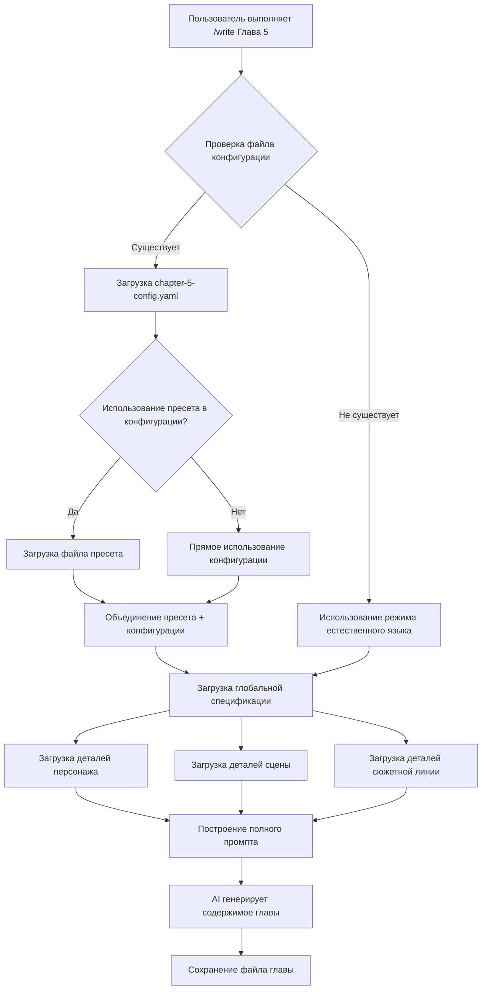

```yaml
# 章节配置文件完整结构
chapter: <number>           # 章节号（必填）
title: <string>             # 章节标题（必填）
description: <string>       # 章节简介（选填）
preset_used: <string>       # 使用的预设名称（选填）
created_at: <datetime>      # 配置创建时间（自动生成）
updated_at: <datetime>      # 配置更新时间（自动生成）

characters:                 # 出场角色列表（选填）
  - id: <string>            # 角色ID（全局规格中的ID，如 protagonist, female-lead）
    name: <string>          # 角色名（用于显示和AI理解）
    focus: <string>         # 角色在本章的焦点程度 (high, medium, low) (选填)
    role: <string>          # 角色在本章的定位 (e.g., antagonist, supporting) (选填)
    state_changes:          # 角色状态变化（选填）
      - attribute: <string> # 属性名 (e.g., relationship_with_protagonist)
        value: <any>        # 新值
        reason: <string>    # 状态变化原因

scene:                      # 场景信息（选填）
  location_id: <string>     # 地点ID（全局规格中的ID，如 office-meeting-room）
  location_name: <string>   # 地点名称（用于显示和AI理解）
  time: <string>            # 时间描述 (e.g., "上午10点", "夜晚")
  atmosphere: <string>      # 氛围情绪 (e.g., tense, relaxed, romantic, suspenseful)
  weather: <string>         # 天气状况 (e.g., sunny, rainy, foggy) (选填)

plot:                       # 情节信息（选填）
  type: <string>            # 剧情类型 (e.g., ability_showcase, relationship_development, conflict, mystery)
  summary: <string>         # 剧情概要
  key_points:               # 关键情节节点（选填）
    - <string>
  goals:                    # 角色目标（选填）
    - character_id: <string>
      objective: <string>
  constraints:              # 情节限制/挑战（选填）
    - <string>

style:                      # 写作风格（选填）
  pace: <string>            # 节奏 (fast, medium, slow)
  sentence_length: <string> # 句子长度 (short, medium, long)
  focus: <string>           # 描写侧重 (dialogue, action, description, internal_monologue)
  tone: <string>            # 语气 (e.g., humorous, serious, formal, informal)
  literary_devices:         # 文学手法（选填）
    - <string>              # e.g., metaphor, simile, foreshadowing

wordcount:                  # 字数要求（选填）
  target: <integer>         # 目标字数
  min: <integer>            # 最低字数
  max: <integer>            # 最高字数

special_requirements: |     # 特殊要求（选填）
  # 多行文本，用于描述AI难以结构化的具体要求
  - 保持悬念
  - 突出角色A的内心挣扎
  - 避免使用陈词滥调

# ------------------------------------------
# 示例：一个简单的章节配置
# ------------------------------------------
# chapter: 5
# title: 初露锋芒
# preset_used: ability_showcase_scene
# created_at: 2025-10-14T10:30:00Z
#
# characters:
#   - id: protagonist
#     name: 林晨
#     focus: high
#   - id: female-lead
#     name: 苏婉
#     focus: medium
#
# scene:
#   location_id: office-meeting-room
#   location_name: 办公室-会议室
#   time: 上午10点
#   atmosphere: tense
#
# plot:
#   type: ability_showcase
#   summary: 主角在技术会议上解决难题，引起女主注意
#   key_points:
#     - 展现编程能力
#     - 首次引起女主关注
#
# style:
#   pace: fast
#   sentence_length: short
#   focus: dialogue_action
#
# wordcount:
#   target: 3000
#   min: 2500
#   max: 3500
#
# special_requirements: |
#   - 重点描写主角解决技术难题的过程
#   - 苏婉的反应要 subtle
```

#### 4.1.2 字段解释

*   **chapter** (int, required): 章节号。
*   **title** (string, required): 章节标题。
*   **description** (string, optional): 章节的简短描述或摘要。
*   **preset\_used** (string, optional): 如果此配置是基于某个预设生成的，则记录预设的名称。
*   **created\_at** (datetime, auto-generated): 配置文件的创建时间戳。
*   **updated\_at** (datetime, auto-generated): 配置文件最后更新的时间戳。
*   **characters** (list of objects, optional):
    *   **id** (string, required): 角色的唯一标识符，应与全局规格系统中的ID匹配（例如 `protagonist`, `female-lead`）。
    *   **name** (string, required): 角色的显示名称。
    *   **focus** (string, optional): 角色在本章的重要性或关注度 (`high`, `medium`, `low`)。
    *   **role** (string, optional): 角色在本章的特定角色（例如 `antagonist`, `supporting_character`, `mentor`）。
    *   **state\_changes** (list of objects, optional): 记录角色在本章中可能发生的状态变化。
        *   **attribute** (string, required): 要更改的状态属性的名称（例如 `relationship_with_protagonist`, `knowledge_level`）。
        *   **value** (any, required): 属性的新值。
        *   **reason** (string, optional): 导致状态变化的原因。
*   **scene** (object, optional):
    *   **location\_id** (string, optional): 地点的唯一标识符，应与全局规格系统中的ID匹配（例如 `office-meeting-room`, `forest-clearing`）。
    *   **location\_name** (string, required): 地点的显示名称。
    *   **time** (string, optional): 对场景发生时间的描述（例如 `"上午10点"`, `"黄昏"`, `"三天后"`）。
    *   **atmosphere** (string, optional): 场景的整体氛围或情绪（例如 `tense`, `relaxed`, `romantic`, `suspenseful`, `chaotic`）。
    *   **weather** (string, optional): 天气状况（例如 `sunny`, `rainy`, `foggy`, `stormy`）。
*   **plot** (object, optional):
    *   **type** (string, optional): 剧情的核心类型或子类型（例如 `ability_showcase`, `relationship_development`, `conflict`, `mystery`, `exposition`）。
    *   **summary** (string, required): 对本章主要情节的简短总结。
    *   **key\_points** (list of strings, optional): 本章需要包含的关键情节节点或事件。
    *   **goals** (list of objects, optional): 角色在本章设定的具体目标。
        *   **character\_id** (string, required): 目标所属角色的ID。
        *   **objective** (string, required): 角色的具体目标。
    *   **constraints** (list of strings, optional): 本章情节中可能遇到的限制、挑战或障碍。
*   **style** (object, optional):
    *   **pace** (string, optional): 写作节奏 (`fast`, `medium`, `slow`)。
    *   **sentence\_length** (string, optional): 句子长度偏好 (`short`, `medium`, `long`)。
    *   **focus** (string, optional): 描写的主要侧重点 (`dialogue`, `action`, `description`, `internal_monologue`, `exposition`)。
    *   **tone** (string, optional): 文本的整体语气（例如 `humorous`, `serious`, `formal`, `informal`, `melancholic`）。
    *   **literary\_devices** (list of strings, optional): 希望使用的文学手法（例如 `metaphor`, `simile`, `foreshadowing`, `irony`）。
*   **wordcount** (object, optional):
    *   **target** (integer, optional): 期望达到的目标字数。
    *   **min** (integer, optional): 允许的最低字数。
    *   **max** (integer, optional): 允许的最高字数。
*   **special\_requirements** (string, optional): 一个多行文本字段，用于输入任何AI难以结构化或需要特别强调的写作要求。

### 4.2 CLI交互式命令

#### 4.2.1 `novel chapter-config create`

*   **功能**: 创建新的章节配置文件。
*   **用法**: `novel chapter-config create <chapter_number> [options]`
*   **模式**:
    *   **交互式 (`--interactive`)**: 启动一个引导式命令行界面，逐步收集章节信息。
    *   **基于预设 (`--preset <preset_name>`)**: 使用指定的预设作为基础，然后允许用户修改。
    *   **从Prompt (`--from-prompt`)**: 尝试解析最近一次AI编辑器中的自然语言Prompt来填充配置。
    *   **直接指定参数**: 允许通过命令行参数直接设置部分字段（例如 `--title "新章节"`）。
*   **交互式界面设计**:
    *   使用类似 `inquirer.js` 或 `prompts` 的库实现。
    *   提供清晰的提示和选项。
    *   支持空格键多选、回车键确认、方向键选择。
    *   对必填项进行校验。
    *   允许用户输入自定义内容。
    *   提供预览和确认步骤。
*   **输出**: 在 `stories/<story_name>/chapters/` 目录下生成 `.yaml` 文件。

#### 4.2.2 `novel chapter-config edit`

*   **功能**: 编辑现有的章节配置文件。
*   **用法**: `novel chapter-config edit <chapter_number_or_file_path>`
*   **行为**:
    *   如果提供章节号，则查找对应的 `.yaml` 文件并打开。
    *   如果提供文件路径，则直接打开该文件。
    *   默认使用系统配置的文本编辑器打开文件。
    *   （可选）可以集成交互式编辑模式，类似 `create --interactive`。

#### 4.2.3 `novel chapter-config list`

*   **功能**: 列出项目中所有已存在的章节配置文件。
*   **用法**: `novel chapter-config list [options]`
*   **选项**:
    *   `--sort <field>`: 按指定字段排序（如 `chapter`, `updated_at`）。
    *   `--filter <field>=<value>`: 过滤配置（例如 `--filter scene.location_id=office`）。
    *   `--output <format>`: 指定输出格式（如 `table`, `json`, `yaml`）。
*   **输出**: 以表格或列表形式显示配置摘要信息（章节号、标题、场景、类型等）。

#### 4.2.4 `novel chapter-config copy`

*   **功能**: 将一个章节配置复制并重命名为新的章节号。
*   **用法**: `novel chapter-config copy <source_chapter> <target_chapter> [options]`
*   **行为**:
    *   复制源章节的配置文件内容。
    *   修改 `chapter` 字段为目标章节号。
    *   更新 `created_at` 和 `updated_at` 时间戳。
    *   （可选）允许用户在复制后立即进入交互式编辑模式 (`--edit`)。

#### 4.2.5 `novel preset list`

*   **功能**: 列出可用的预设模板。
*   **用法**: `novel preset list [options]`
*   **选项**:
    *   `--category <category_name>`: 按类别过滤预设（例如 `scene`, `plot_type`, `style`）。
    *   `--search <keyword>`: 按关键词搜索预设名称或描述。
*   **输出**: 显示预设名称、简短描述、适用场景等信息。

#### 4.2.6 `novel preset create`

*   **功能**: 创建一个新的预设模板。
*   **用法**: `novel preset create <preset_name> [options]`
*   **行为**:
    *   允许用户通过交互式界面或命令行参数定义预设内容（可以基于现有配置或手动输入）。
    *   将预设保存在预定义的预设目录中。

#### 4.2.7 `novel preset edit`

*   **功能**: 编辑现有的预设模板。
*   **用法**: `novel preset edit <preset_name>`

### 4.3 AI编辑器集成

*   **命令**: `/write <chapter_number>`
*   **逻辑**:
    1.  **检测配置文件**: 检查 `stories/<story_name>/chapters/chapter-<chapter_number>-config.yaml` 是否存在。
    2.  **无配置**:
        *   如果文件不存在，则回退到传统的自然语言解析模式。
        *   AI尝试解析用户输入的自然语言指令（如“本章要点：...”）。
        *   加载全局规格系统。
        *   生成章节内容。
        *   （可选）在输出或编辑器中提示用户：“检测到您使用的是自然语言配置，是否要为其创建结构化配置？”并提供创建命令。
    3.  **有配置**:
        *   加载找到的章节配置文件 (`chapter-<chapter_number>-config.yaml`)。
        *   加载全局规格系统（`novel-constitution.md`, `character-profiles.md`, `world-setting.md` 等）。
        *   AI结合章节配置和全局规格，生成章节内容。
        *   将生成的内容保存到 `stories/<story_name>/content/第<chapter_number>章.md`。
        *   （可选）在配置文件中更新 `updated_at` 时间戳。
*   **AI能力要求**:
    *   能够理解YAML结构化数据。
    *   能够根据结构化参数和自然语言提示（来自全局规格）生成连贯、符合要求的文本。
    *   能够处理参数间的冲突或优先级（例如，`style.pace` 在配置中和全局规格中都有定义时，以章节配置为准）。

### 4.4 预设系统

*   **目的**: 提供常用场景、风格、情节类型的预设配置，降低用户门槛，保证一致性。
*   **结构**: 预设可以存储在独立的目录（例如 `presets/`）下，每个预设是一个 `.yaml` 文件，定义了部分或全部章节配置字段。
*   **类型**:
    *   **场景预设**: 如 `action-intense`, `emotional-dialogue`, `mystery-suspense`。
    *   **风格预设**: 如 `fast-paced-short-sentences`, `detailed-description`。
    *   **情节预设**: 如 `ability-showcase`, `character-introduction`。
*   **继承与覆盖**: 当用户使用预设创建配置时，预设内容会被加载，用户后续的输入或修改会覆盖预设中的相应字段。
*   **社区生态**: 允许用户自定义预设并分享，形成预设库。

### 4.5 版本控制与追踪

*   **Git集成**:
    *   所有章节配置文件（`.yaml`）应被纳入Git版本控制。
    *   每次使用 `/write` 命令生成章节内容后，如果配置文件有更新（例如 `updated_at` 变化），或者生成了新的章节内容文件，都应被视为一次可提交的变更。
    *   用户可以通过Git命令（`git diff`, `git log`）查看配置和内容的变更历史。
*   **追踪价值**:
    *   **可追溯性**: 清楚了解每一章的写作参数是如何确定的。
    *   **可复现性**: 能够回滚到之前的配置状态。
    *   **协作**: 团队成员可以共享和审查配置。

---

## 五、未来展望

*   **可视化配置界面**: 开发一个Web或桌面应用，提供图形化的章节配置编辑器，替代CLI。
*   **智能推荐**: 基于用户写作历史和全局规格，AI自动推荐合适的章节配置或预设。
*   **预设市场**: 建立一个社区平台，供用户分享、下载和评价预设。
*   **与其他工具集成**: 与项目管理工具、云存储等集成。
*   **动态配置**: 允许在写作过程中动态调整章节配置，AI实时响应。

---

## 六、附录

### 6.1 全局规格系统引用

本系统依赖以下全局规格文件：

*   `memory/novel-constitution.md`
*   `stories/*/specification.md`
*   `spec/tracking/character-state.json`
*   `spec/tracking/relationships.json`
*   `spec/tracking/plot-tracker.json`
*   `spec/tracking/timeline.json`
*   `spec/knowledge/character-profiles.md`
*   `spec/knowledge/world-setting.md`
*   `spec/knowledge/locations.md`

### 6.2 术语表

*   **章节配置文件 (Chapter Configuration File)**: 用于定义单章写作参数的YAML文件。
*   **预设 (Preset)**: 预先定义好的章节配置模板，用于快速创建新配置。
*   **全局规格系统 (Global Specification System)**: 存储小说整体设定的文件集合，为章节写作提供背景和约束。
*   **CLI (Command Line Interface)**: 命令行交互界面。
*   **AI编辑器 (AI Editor)**: 集成AI写作功能的编辑器（如Claude Code）。

---
```
# Конфигурация персонажей
characters:
  - id: <string>            # ID персонажа (ссылка на character-profiles.md)
    name: <string>          # Имя персонажа
    focus: <high|medium|low>  # Степень важности персонажа в главе
    state_changes:          # Изменения состояния персонажа в главе (опционально)
      - ранен
      - настроение улучшилось

# Конфигурация сцены
scene:
  location_id: <string>     # ID локации (ссылка на locations.md)
  location_name: <string>   # Название локации
  time: <string>            # Время (например, "10 утра", "вечер")
  weather: <string>         # Погода (опционально)
  atmosphere: <tense|relaxed|sad|exciting>  # Атмосфера

# Конфигурация сюжета
plot:
  type: <enum>              # Тип сюжета (см. перечисление)
  summary: <string>         # Краткое содержание главы (обязательно)
  key_points:               # Ключевые моменты (массив)
    - <string>
  plotlines:                # Задействованные сюжетные линии (ссылка на specification.md)
    - PL-01
    - PL-02
  foreshadowing:            # Заложенные в главе предзнаменования (опционально)
    - id: F-005
      content: Упоминание таинственной организации

# Конфигурация стиля письма
style:
  pace: <fast|medium|slow>  # Темп
  sentence_length: <short|medium|long>  # Длина предложений
  focus: <action|dialogue|psychology|description>  # Фокус описания
  tone: <serious|humorous|dark|light>  # Тон (опционально)

# Требования к объему
wordcount:
  target: <number>          # Целевой объем
  min: <number>             # Минимальный объем
  max: <number>             # Максимальный объем

# Особые требования
special_requirements: |     # Другие особые требования к написанию (текстовый блок)
  - Требование 1
  - Требование 2

# Метаинформация
preset_used: <string>       # Использованный пресет (опционально)
created_at: <datetime>      # Время создания
updated_at: <datetime>      # Время обновления
```

#### 4.1.2 Перечисление типов сюжета

```yaml
plot_types:
  - ability_showcase      # Демонстрация способностей
  - relationship_dev      # Развитие отношений
  - conflict_combat       # Конфликт и противостояние
  - mystery_suspense      # Загадка и напряжение
  - transition            # Переход, связка
  - climax                # Кульминация, решающее противостояние
  - emotional_scene       # Эмоциональная сцена
  - world_building        # Раскрытие мира
  - plot_twist            # Сюжетный поворот
```

#### 4.1.3 Пример конфигурационного файла

См. полный пример в каталоге `docs/prd/chapter/examples/`.

### 4.2 Проектирование команд CLI

#### 4.2.1 Список команд

```bash
# ========== Управление конфигурацией глав ==========
novel chapter-config create <chapter>       # Создать конфигурацию главы
  --interactive                              # Интерактивное создание (рекомендуется)
  --preset <preset-id>                       # Использовать пресет
  --from-prompt                              # Сгенерировать из естественного языка

novel chapter-config edit <chapter>         # Редактировать конфигурацию главы
  --editor <editor>                          # Указать редактор (по умолчанию vim)

novel chapter-config list                   # Вывести список всех конфигураций глав
  --format <table|json|yaml>                 # Формат вывода

novel chapter-config copy <from> <to>       # Скопировать конфигурацию
  --interactive                              # Интерактивно изменить различия

novel chapter-config delete <chapter>       # Удалить конфигурацию

novel chapter-config validate <chapter>     # Проверить конфигурационный файл

# ========== Управление пресетами ==========
novel preset list                           # Вывести список всех пресетов
  --category <scene|style|chapter>           # Фильтр по категории

novel preset show <preset-id>               # Показать детали пресета

novel preset create <preset-id>             # Создать пользовательский пресет
  --interactive                              # Интерактивное создание

novel preset import <file>                  # Импортировать пресет сообщества

novel preset export <preset-id>             # Экспортировать пресет
  --output <file>                            # Выходной файл

# ========== Управление шаблонами глав ==========
novel chapter-template list                 # Вывести список шаблонов конфигурации глав

novel chapter-template export <chapter>     # Экспортировать как шаблон
  --name <template-name>
```

#### 4.2.2 Детальный дизайн команд

**Команда 1: `novel chapter-config create`**

```typescript
interface CreateOptions {
  interactive?: boolean;    // Интерактивный режим
  preset?: string;         // ID используемого пресета
  fromPrompt?: boolean;    // Генерация из естественного языка
  characters?: string[];   // Указание персонажей
  scene?: string;          // Указание сцены
  plotType?: string;       // Тип сюжета
  wordcount?: number;      // Целевой объем
}

// Пример использования
$ novel chapter-config create 5 --interactive
$ novel chapter-config create 8 --preset action-intense
$ novel chapter-config create 10 --characters protagonist,female-lead --scene office
```

**Команда 2: `novel preset list`**

```bash
# Формат вывода
$ novel preset list --category scene

📦 Пресеты сцен (6 шт.):

  action-intense         Интенсивная экшн-сцена
    Подходит для: драк, погонь и других высокоинтенсивных действий
    Стиль: быстрый темп, короткие предложения, плотное описание действий
    Объем: 2500-3500 слов

  emotional-dialogue     Эмоциональная диалоговая сцена
    Подходит для: признаний, ссор и других эмоциональных сцен
    Стиль: плотные диалоги, психологическое описание, тонкие эмоции
    Объем: 2000-3000 слов

  [Больше...]
```

### 4.3 Интеграция команд с косой чертой (обновление шаблона write.md)

#### 4.3.1 Обновленный процесс write.md

```markdown
---
description: Выполнение написания главы на основе списка задач, автоматическая загрузка контекста и правил проверки
argument-hint: [Номер главы или ID задачи]
model: claude-sonnet-4-5-20250929
---

## Предварительные проверки

1. **Проверка конфигурационного файла главы** (Новое)
   - Проверить наличие `stories/*/chapters/chapter-X-config.yaml`
   - Если существует, загрузить конфигурационный файл
   - Распарсить конфигурацию главы, извлечь структурированные параметры

2. **Загрузка глобального контекста** (Сохранено)
   - `memory/novel-constitution.md` (Конституция творчества - высшие принципы)
   - `memory/style-reference.md` (Справочник по стилю)
   - `stories/*/specification.md` (Спецификация истории)
   - `stories/*/creative-plan.md` (План творчества)
   - `spec/tracking/character-state.json` (Состояние персонажей)
   - `spec/tracking/relationships.json` (Сеть отношений)
   - Соответствующие файлы `spec/knowledge/`

3. **Загрузка подробной информации в соответствии с конфигурацией** (Новое)
   ```
   Если конфигурация указывает:
   - characters: [protagonist, female-lead]
     → Загрузить подробные профили из spec/knowledge/character-profiles.md
     → Загрузить последнее состояние из spec/tracking/character-state.json

   - scene.location_id: office-meeting-room
     → Загрузить детали сцены из spec/knowledge/locations.md

   - plotlines: [PL-01, PL-02]
     → Загрузить детали сюжетных линий из stories/*/specification.md
   ```

## Процесс выполнения написания

### 1. Построение промпта для главы (Новая инъекция структурированных параметров)

**При наличии конфигурационного файла**:

```
📋 Конфигурация главы:

**Основная информация**:
- Глава: Глава 5 - Первые успехи
- Требования к объему: 2500-3500 слов (цель 3000 слов)

**Появляющиеся персонажи**:
- Линь Чэнь (Главный герой - ключевой персонаж)
  Текущее состояние: [Чтение из character-state.json]
  Характер: [Чтение из character-profiles.md]

- Су Вань (Главная героиня - средняя роль)
  Текущее состояние: [Чтение]
  Характер: [Чтение]

**Настройка сцены**:
- Место: Офис - конференц-зал
  Детали: [Чтение описания сцены из locations.md]
- Время: 10 утра
- Атмосфера: Напряженная

**Требования к сюжету**:
- Тип: Демонстрация способностей
- Краткое содержание: Главный герой решает техническую проблему на совещании, привлекая внимание главной героини
- Ключевые моменты:
  1. Демонстрация навыков программирования
  2. Первое привлечение внимания главной героини
  3. Заложение основы для линии злодея

**Стиль письма**:
- Темп: Быстрый
- Длина предложений: Преимущественно короткие (15-25 слов)
- Фокус: Диалоги + описание действий
- Особые требования:
  - Технические описания должны быть точными, но не запутанными
  - Реакция главной героини должна быть тонкой
  - Оставить интригу в конце

[Затем загрузить глобальную спецификацию...]
```

**При отсутствии конфигурационного файла** (обратная совместимость):

```
📋 На основе описания пользователя:

[Парсинг естественного языка]

[Загрузка глобальной спецификации...]
```

### 2. Генерация контента главы (Сохранение исходного процесса)

### 3. Самопроверка качества (Сохранение исходного процесса)

### 4. Сохранение и обновление (Новая запись конфигурации)

- Сохранить контент главы в `stories/*/content/Глава X.md`
- Обновить временную метку `updated_at` в `chapter-X-config.yaml`
- Обновить статус задачи
```

#### 4.3.2 Приоритет загрузки конфигурации

```
Приоритет (Высокий → Низкий):

1. Конфигурационный файл главы (chapter-X-config.yaml)
   └─ Параметры, специфичные для главы

2. Файл пресета (если используется)
   └─ Значения по умолчанию пресета

3. Глобальная спецификация (specification.md)
   └─ Настройки на уровне истории

4. Конституция творчества (novel-constitution.md)
   └─ Высшие принципы и ценности

5. Стратегия слияния:
- Конфигурация главы переопределяет пресет
- Пресет дополняет значения по умолчанию
- Глобальная спецификация предоставляет фон
- Конституция предоставляет принципы
```

### 4.4 Проектирование системы пресетов

#### 4.4.1 Структура файлов пресетов

```
~/.novel/presets/           # Библиотека пресетов в пользовательском каталоге
├── official/               # Официальные пресеты
│   ├── scenes/
│   │   ├── action-intense.yaml
│   │   ├── emotional-dialogue.yaml
│   │   └── mystery-suspense.yaml
│   ├── styles/
│   │   ├── fast-paced.yaml
│   │   └── detailed-narrative.yaml
│   └── chapters/
│       ├── opening.yaml
│       └── climax.yaml
├── user/                   # Пользовательские пресеты
│   └── my-battle-scene.yaml
└── community/              # Пресеты сообщества (загруженные из Dreams)
    └── popular-preset-1.yaml
```

#### 4.4.2 Формат файлов пресетов

```yaml
# ~/.novel/presets/official/scenes/action-intense.yaml
id: action-intense
name: Интенсивная экшн-сцена
description: Подходит для описания драк, погонь и других высокоинтенсивных действий
category: scene
author: Novel Writer Official
version: 1.0.0

# Значения конфигурации по умолчанию
defaults:
  style:
    pace: fast
    sentence_length: short
    focus: action_description
    tone: serious

  wordcount:
    target: 3000
    min: 2500
    max: 3500

  special_requirements: |
    - Преимущественно короткие предложения, 15-25 слов в каждом
    - Плотное описание действий, подчеркивающее ощущение удара и ритм
    - Уменьшить описание психологических состояний, сосредоточиться на действиях
    - Быстрое переключение сцен и точек зрения
    - Избегать избыточных описаний окружения

# Рекомендуемые настройки
recommended:
  plot_types:
    - conflict_combat
    - climax
  atmosphere:
    - tense
    - exciting

# Совместимость
compatible_genres:
  - xuanhuan
  - wuxia
  - dushi
  - kehuan

# Советы по использованию
usage_tips:
  - Подходит для кульминационных частей главы
  - Рекомендуется использовать с короткими главами (2000-3500 слов)
  - Требует глав для подготовки и завершения
```

#### 4.4.3 Логика применения пресетов

```typescript
// Алгоритм применения пресетов
function applyPreset(
  preset: Preset,
  userInput: Partial<ChapterConfig>
): ChapterConfig {
  return {
    // Ввод пользователя имеет наивысший приоритет
    ...preset.defaults,
    ...userInput,

    // Слияние special_requirements
    special_requirements: [
      preset.defaults.special_requirements,
      userInput.special_requirements
    ].filter(Boolean).join('\n\n'),

    // Запись использованного пресета
    preset_used: preset.id,
  };
}
```

### 4.5 Правила проверки конфигурации

#### 4.5.1 Контрольный список проверок

```typescript
interface ValidationRules {
  // Проверка обязательных полей
  required_fields: [
    'chapter',
    'title',
    'plot.summary',
    'wordcount.target'
  ];

  // Проверка типов данных
  type_checks: {
    chapter: 'number',
    title: 'string',
    'characters[].focus': ['high', 'medium', 'low'],
    'style.pace': ['fast', 'medium', 'slow'],
    // ...
  };

  // Проверка целостности ссылок
  reference_checks: {
    'characters[].id': 'character-profiles.md',
    'scene.location_id': 'locations.md',
    'plot.plotlines[]': 'specification.md',
  };

  // Проверка логической согласованности
  logic_checks: [
    'wordcount.min <= wordcount.target <= wordcount.max',
    'characters.length >= 1',
    'plot.key_points.length >= 1'
  ];
}
```

#### 4.5.2 Сообщения об ошибках проверки

```bash
$ novel chapter-config validate 5

🔍 Проверка конфигурационного файла: chapter-5-config.yaml

❌ Проверка не пройдена (2 ошибки):

  1. Ошибка ссылки (characters[1].id)
     └─ ID персонажа "unknown-person" не существует в character-profiles.md
     Рекомендация: Проверьте профиль персонажа или исправьте ID

  2. Логическая ошибка (wordcount)
     └─ min(3500) > target(3000)
     Рекомендация: Отрегулируйте диапазон объема так, чтобы min <= target <= max

⚠️  Предупреждение (1):

  1. Лучшая практика (plot.key_points)
     └─ Рекомендуется иметь не менее 3 ключевых моментов, сейчас их 2
```

---

## Пять. Техническое решение

### 5.1 Проектирование структуры файлов

```
Структура проекта:

stories/
  └── my-story/
      ├── specification.md           # Глобальная спецификация (существует)
      ├── creative-plan.md           # План творчества (существует)
      ├── chapters/                  # 🆕 Каталог конфигурации глав
      │   ├── chapter-1-config.yaml
      │   ├── chapter-2-config.yaml
      │   ├── chapter-5-config.yaml
      │   └── ...
      └── content/                   # Содержимое глав (существует)
          ├── 第1章.md
          ├── 第2章.md
          └── ...

Библиотека пресетов:

~/.novel/presets/                  # 🆕 Глобальный каталог пресетов
├── official/                      # Официальные пресеты
│   ├── scenes/
│   ├── styles/
│   └── chapters/
├── user/                          # Пользовательские
└── community/                     # Общедоступные

node_modules/novel-writer-cn/      # Встроенные в пакет npm
└── presets/                       # Встроенные официальные пресеты
    ├── action-intense.yaml
    ├── emotional-dialogue.yaml
    └── ...
```

### 5.2 Процесс загрузки конфигурации



### 5.3 Точки интеграции с существующей системой

#### 5.3.1 Интеграция с шаблоном write.md

**Пункт изменения 1: Шаг предварительной проверки**

```markdown
## Предварительная проверка

1. Запуск скрипта `{SCRIPT}` для проверки статуса творчества

2. **🆕 Проверка файла конфигурации главы**
   ```bash
   config_file="stories/*/chapters/chapter-$CHAPTER-config.yaml"
   if [ -f "$config_file" ]; then
     echo "✅ Обнаружен файл конфигурации, загрузка..."
     # Парсинг YAML и извлечение параметров
   else
     echo "ℹ️  Файл конфигурации не найден, используется режим естественного языка"
   fi
   ```

3. Запрос протокола (документ наивысшего приоритета)
   - `memory/novel-constitution.md`
   - ... (сохраняется как есть)
```

**Пункт изменения 2: Построение промпта**

```markdown
### Построение промпта для написания главы

**При наличии файла конфигурации**:
```
📋 Конфигурация главы:
[Внедрение структурированных параметров]

**Основная информация**:
- Глава: Глава {{chapter}} - {{title}}
- Объем: {{wordcount.min}}-{{wordcount.max}} слов (цель {{wordcount.target}} слов)

**Появляющиеся персонажи** ({{characters.length}} чел.):
{{#each characters}}
- {{name}} ({{role}} - фокус на {{focus}})
  Характер: [Чтение из character-profiles.md]
  Текущее состояние: [Чтение из character-state.json]
{{/each}}

...
```

**При отсутствии файла конфигурации** (обратная совместимость):
```
📋 На основе ввода пользователя:
[Сохранение парсинга естественного языка]
```
```

#### 5.3.2 Интеграция с character-state.json

```typescript
// Ссылка на ID персонажа в файле конфигурации
characters:
  - id: protagonist    // Ссылка на ID
    name: Лин Чен
    focus: high

// При загрузке AI
1. Чтение spec/knowledge/character-profiles.md
   → Поиск полного профиля protagonist

2. Чтение spec/tracking/character-state.json
   → Получение последнего состояния
   {
     "protagonist": {
       "location": "Компания",
       "health": "Хорошее",
       "mood": "Уверенный",
       "relationships": {
         "female-lead": "Только познакомились, есть симпатия"
       }
     }
   }

3. Объединение информации и внедрение в промпт
```

#### 5.3.3 Интеграция с specification.md (система сюжетных линий)

```yaml
# Указание затрагиваемых сюжетных линий в файле конфигурации
plot:
  plotlines:
    - PL-01    # Основная линия: развитие карьеры
    - PL-02    # Побочная линия: любовная линия

# При загрузке AI
1. Чтение таблицы определения сюжетных линий из stories/*/specification.md
2. Извлечение подробной информации о PL-01 и PL-02
3. Обеспечение продвижения этих двух сюжетных линий в данной главе
4. Обновление spec/tracking/plot-tracker.json после написания
```

### 5.4 Основные моменты реализации CLI (TypeScript)

#### 5.4.1 Дизайн основного класса

```typescript
// src/core/chapter-config.ts

import yaml from 'js-yaml';
import fs from 'fs-extra';
import path from 'path';

/**
 * Менеджер конфигурации глав
 */
export class ChapterConfigManager {
  constructor(private projectPath: string) {}

  /**
   * Создание конфигурации главы
   */
  async createConfig(
    chapter: number,
    options: CreateConfigOptions
  ): Promise<ChapterConfig> {
    const config: ChapterConfig = {
      chapter,
      title: options.title || `Глава ${chapter}`,
      characters: [],
      scene: {},
      plot: {
        type: options.plotType || 'transition',
        summary: '',
        key_points: []
      },
      style: {
        pace: 'medium',
        sentence_length: 'medium',
        focus: 'balanced'
      },
      wordcount: {
        target: 3000,
        min: 2500,
        max: 3500
      },
      created_at: new Date().toISOString()
    };

    // Если используется пресет
    if (options.preset) {
      const preset = await this.loadPreset(options.preset);
      Object.assign(config, this.applyPreset(preset, config));
    }

    // Сохранение файла конфигурации
    const configPath = this.getConfigPath(chapter);
    await fs.writeFile(
      configPath,
      yaml.dump(config, { indent: 2 })
    );

    return config;
  }

  /**
   * Загрузка конфигурации главы
   */
  async loadConfig(chapter: number): Promise<ChapterConfig | null> {
    const configPath = this.getConfigPath(chapter);
    if (!await fs.pathExists(configPath)) {
      return null;
    }

    const content = await fs.readFile(configPath, 'utf-8');
    return yaml.load(content) as ChapterConfig;
  }

  /**
   * Валидация конфигурации
   */
  async validateConfig(chapter: number): Promise<ValidationResult> {
    const config = await this.loadConfig(chapter);
    if (!config) {
      return {
        valid: false,
        errors: ['Файл конфигурации не существует']
      };
    }

    const errors: string[] = [];
    const warnings: string[] = [];

    // Проверка обязательных полей
    if (!config.title) errors.push('Отсутствует заголовок');
    if (!config.plot.summary) errors.push('Отсутствует краткое изложение сюжета');

    // Проверка целостности ссылок
    for (const char of config.characters || []) {
      const exists = await this.checkCharacterExists(char.id);
      if (!exists) {
        errors.push(`ID персонажа "${char.id}" не существует`);
      }
    }

    // Проверка логической согласованности
    const { min, target, max } = config.wordcount;
    if (min > target || target > max) {
      errors.push('Ошибка логики диапазона количества слов');
    }

    // Предупреждения о лучших практиках
    if ((config.plot.key_points?.length || 0) < 3) {
      warnings.push('Рекомендуется указать как минимум 3 ключевых момента');
    }

    return {
      valid: errors.length === 0,
      errors,
      warnings
    };
  }

  /**
   * Список всех конфигураций
   */
  async listConfigs(): Promise<ChapterConfigSummary[]> {
    const chaptersDir = path.join(
      this.projectPath,
      'stories',
      '*',
      'chapters'
    );

    // Реализация опущена...
  }

  private getConfigPath(chapter: number): string {
    // Реализация опущена...
  }

  private async loadPreset(presetId: string): Promise<Preset> {
    // Реализация опущена...
  }

  private applyPreset(
    preset: Preset,
    config: ChapterConfig
  ): Partial<ChapterConfig> {
    // Реализация опущена...
  }

  private async checkCharacterExists(id: string): Promise<boolean> {
    // Реализация опущена...
  }
}
```

#### 5.4.2 Интерактивная реализация CLI

```typescript
// src/commands/chapter-config.ts

import inquirer from 'inquirer';
import { ChapterConfigManager } from '../core/chapter-config.js';

export async function createConfigInteractive(
  chapter: number
): Promise<void> {
  const manager = new ChapterConfigManager(process.cwd());

  // Загрузка доступных ресурсов
  const characters = await loadAvailableCharacters();
  const scenes = await loadAvailableScenes();

  // Интерактивные вопросы
  const answers = await inquirer.prompt([
    {
      type: 'input',
      name: 'title',
      message: 'Заголовок главы:',
      validate: (input) => input.length > 0
    },
    {
      type: 'checkbox',
      name: 'characters',
      message: 'Выберите появляющихся персонажей (пробел для выбора, Enter для подтверждения):',
      choices: characters.map(c => ({
        name: `${c.name} (${c.role} - ${c.gender} - ${c.age} лет)`,
        value: c.id
      }))
    },
    {
      type: 'list',
      name: 'scene',
      message: 'Выберите сцену:',
      choices: scenes.map(s => ({
        name: s.name,
        value: s.id
      }))
    },
    {
      type: 'list',
      name: 'atmosphere',
      message: 'Атмосфера/Настроение:',
      choices: [
        { name: 'Напряженная', value: 'tense' },
        { name: 'Расслабленная', value: 'relaxed' },
        { name: 'Грустная', value: 'sad' },
        { name: 'Воодушевляющая', value: 'exciting' }
      ]
    },
    {
      type: 'list',
      name: 'plotType',
      message: 'Тип сюжета:',
      choices: [
        { name: 'Демонстрация способностей', value: 'ability_showcase' },
        { name: 'Развитие отношений', value: 'relationship_dev' },
        { name: 'Конфронтация', value: 'conflict_combat' },
        { name: 'Создание интриги', value: 'mystery_suspense' }
      ]
    },
    {
      type: 'list',
      name: 'pace',
      message: 'Стиль письма:',
      choices: [
        { name: 'Быстрый темп', value: 'fast' },
        { name: 'Детальное описание', value: 'detailed' },
        { name: 'Много диалогов', value: 'dialogue' },
        { name: 'Повествование', value: 'narrative' }
      ]
    },
    {
      type: 'number',
      name: 'wordcount',
      message: 'Целевое количество слов:',
      default: 3000,
      validate: (input) => input >= 1000 && input <= 10000
    }
  ]);

  // Создание конфигурации
  const config = await manager.createConfig(chapter, {
    title: answers.title,
    characters: answers.characters,
    scene: answers.scene,
    atmosphere: answers.atmosphere,
    plotType: answers.plotType,
    style: { pace: answers.pace },
    wordcount: {
      target: answers.wordcount,
      min: Math.floor(answers.wordcount * 0.8),
      max: Math.floor(answers.wordcount * 1.2)
    }
  });

  console.log(chalk.green(`\n✅ Конфигурация сохранена: ${getConfigPath(chapter)}`));
}
```

### 5.5 Дизайн библиотеки пресетов

#### 5.5.1 Встроенный список пресетов

**Пресеты сцен (6 шт.)**:
1. `action-intense` - Сцена напряженного действия
2. `emotional-dialogue` - Сцена эмоционального диалога
3. `mystery-suspense` - Сцена интриги и напряжения
4. `world-building` - Сцена раскрытия мироустройства
5. `comedic-relief` - Сцена для разрядки юмором
6. `transition` - Переходная сцена

**Пресеты стиля (4 шт.)**:
1. `fast-paced` - Быстрый темп письма
2. `detailed-narrative` - Детальное повествование
3. `dialogue-heavy` - С преобладанием диалогов
4. `psychological-deep` - Глубокое психологическое описание

**Пресеты глав (4 шт.)**:
1. `opening-chapter` - Вступительная глава
2. `climax-chapter` - Кульминационная глава
3. `turning-point` - Поворотная глава
4. `ending-chapter` - Заключительная глава

#### 5.5.2 Приоритет загрузки пресетов

```
Порядок загрузки:

1. Локальные пресеты проекта
   stories/*/presets/*.yaml

2. Пользовательские пресеты
   ~/.novel/presets/user/*.yaml

3. Общедоступные пресеты
   ~/.novel/presets/community/*.yaml

4. Официальные пресеты
   ~/.novel/presets/official/*.yaml

5. Встроенные пресеты
   node_modules/novel-writer-cn/presets/*.yaml

Правило: Одноименные пресеты с более высоким приоритетом перезаписывают пресеты с более низким приоритетом.
```

---

## Шесть. Интеграция с Dreams (долгосрочное планирование)

### 6.1 Архитектура интеграции

```
┌────────── Dreams Web ──────────┐
│                                │
│  📝 Форма конфигурации главы    │
│  - Выбор персонажа (из библиотеки) │
│  - Выбор сцены (из библиотеки)   │
│  - Конфигурация стиля (выпадающий список/выбор одного) │
│  - Выбор пресета (рекомендуемые пресеты) │
│                                │
│  [Сохранить конфигурацию] [Синхронизировать с локальной] │
│                                │
└────────┬───────────────────────┘
         │
         │ API: POST /api/chapter-config
         │ Response: { configId, yamlContent }
         ↓
```markdown
┌────────── Синхронизация CLI ──────────┐
│                                     │
│  $ novel sync chapter 5             │
│                                     │
│  1. Вызов Dreams API               │
│  2. Загрузка конфигурации YAML       │
│  3. Сохранение локально            │
│     stories/*/chapters/             │
│                                     │
└────────┬────────────────────────────┘
         │
         │ Локальные файлы
         ↓
┌──── AI Редактор (Claude Code) ────┐
│                                     │
│  Ввод пользователя: /write Глава 5  │
│                                     │
│  Действия ИИ:                      │
│  1. Чтение chapter-5-config.yaml  │
│  2. Загрузка глобальных спецификаций│
│  3. Генерация контента главы        │
│                                     │
└─────────────────────────────────────┘
```

### 6.2 Дизайн функции Dreams

#### 6.2.1 Страница конфигурации главы

**Путь к странице**: `https://dreams.wordflowlab.com/chapter-config/create`

**Модули функции**:

1. **Основная информация**
   - Номер главы (поле ввода)
   - Заголовок (поле ввода)

2. **Выбор персонажей**
   - Загрузка из библиотеки профилей персонажей (`character-profiles.md`)
   - Флажки, отображающие имя персонажа, пол, возраст, роль
   - Возможность установить долю участия для каждого персонажа (high/medium/low)

3. **Конфигурация сцены**
   - Загрузка из библиотеки сцен (`locations.md`)
   - Выбор сцены из выпадающего списка
   - Предварительный просмотр деталей сцены
   - Возможность быстрого создания новой сцены

4. **Конфигурация сюжета**
   - Тип сюжета (один выбор)
   - Краткое изложение сюжета (текстовое поле)
   - Ключевые моменты (динамический список)
   - Задействованные сюжетные линии (множественный выбор, загрузка из specification.md)

5. **Конфигурация стиля**
   - Темп (один выбор: быстрый/средний/медленный)
   - Длина предложений (один выбор: короткие/средние/длинные)
   - Фокус описания (один выбор: действие/диалог/психология/описание)
   - Целевое количество слов (ползунок: 1000-10000)

6. **Система пресетов**
   - Список рекомендуемых пресетов (на основе типа сюжета)
   - Предварительный просмотр пресетов
   - Применение пресетов в один клик

#### 6.2.2 Дизайн механизма синхронизации

**Решение 1: Синхронизация в реальном времени**

```typescript
// Пользователь нажимает "Синхронизировать с локальным" в Dreams
POST /api/chapter-config/sync
Request: {
  configId: "abc123",
  projectPath: "/Users/user/my-story"
}

Response: {
  success: true,
  yamlContent: "...",  // Содержимое файла конфигурации
  localPath: "stories/my-story/chapters/chapter-5-config.yaml"
}

// CLI получает и сохраняет
$ novel sync chapter 5 --from-web abc123

✅ Конфигурация синхронизирована локально
📁 stories/my-story/chapters/chapter-5-config.yaml
```

**Решение 2: Механизм сессий (рекомендуется)**

```typescript
// 1. Пользователь создает конфигурацию в Dreams
POST /api/chapter-config/create
Response: {
  sessionId: "sess_xyz789",
  expiresIn: 1800  // 30 минут
}

// 2. CLI опрашивает или получает напрямую
$ novel write 5 --web-session sess_xyz789

// 3. CLI вызывает API для получения конфигурации
GET /api/sessions/sess_xyz789
Response: {
  chapterConfig: { ... },  // Объект YAML
  projectInfo: { ... }
}

// 4. CLI генерирует локальный файл конфигурации и запускает написание
```

### 6.3 Дизайн API Dreams

```typescript
// Спецификация API Dreams

/**
 * Создание конфигурации главы
 */
POST /api/chapter-config
Request: ChapterConfig
Response: {
  id: string;
  yamlContent: string;
  createdAt: string;
}

/**
 * Получение конфигурации главы
 */
GET /api/chapter-config/:id
Response: ChapterConfig

/**
 * Создание сессии (для использования CLI)
 */
POST /api/chapter-config/:id/session
Response: {
  sessionId: string;
  expiresAt: string;
  downloadUrl: string;
}

/**
 * Получение данных сессии
 */
GET /api/sessions/:sessionId
Response: {
  config: ChapterConfig;
  metadata: {
    projectName: string;
    chapterNumber: number;
  }
}

/**
 * Синхронизация с локальным проектом
 */
POST /api/sync/chapter-config
Request: {
  configId: string;
  projectToken: string;  // Токен аутентификации проекта
}
Response: {
  success: boolean;
  localPath: string;
}
```

### 6.4 Приоритеты интеграции

**Этап 1 (Краткосрочный)**: Локальное решение только CLI
- Реализация системы конфигурационных файлов глав
- Реализация системы пресетов
- Обновление шаблона write.md

**Этап 2 (Среднесрочный)**: Базовая интеграция с Dreams
- Страница формы Dreams
- Механизм сессий
- Команда синхронизации CLI

**Этап 3 (Долгосрочный)**: Полная экосистема
- Управление облачными конфигурациями
- Обмен пресетами в сообществе
- Визуальный редактор конфигураций

---

## Семь. План реализации

### 7.1 Разделение на этапы

#### Этап 1: Основная система конфигурации (2-3 дня)

**Цель**: Реализация создания, загрузки и проверки конфигурационных файлов глав

**Результаты**:
- [ ] Определение схемы YAML для конфигурации глав
- [ ] Основной класс ChapterConfigManager
- [ ] Команды CLI: `chapter-config create/edit/list/validate`
- [ ] Примеры конфигурационных файлов (5 шт.)
- [ ] Модульные тесты

**Критерии приемки**:
- Конфигурационные файлы могут быть созданы через CLI
- Файлы конфигурации корректно проверяются
- Функция перечисления всех конфигураций работает корректно

#### Этап 2: Система пресетов (1-2 дня)

**Цель**: Реализация библиотеки пресетов и механизма их применения

**Результаты**:
- [ ] Определение формата файлов пресетов
- [ ] Основной класс PresetManager
- [ ] Команды CLI: `preset list/show/create/import/export`
- [ ] Встроенные пресеты (14 шт.)
- [ ] Логика применения пресетов

**Критерии приемки**:
- Пресеты можно перечислять и просматривать
- Конфигурация может быть создана с использованием пресетов
- Пресеты корректно применяются к конфигурации

#### Этап 3: Интеграция write.md (1 день)

**Цель**: Обновление шаблона write.md для поддержки загрузки конфигурационных файлов

**Результаты**:
- [ ] Обновление шагов предварительной проверки write.md
- [ ] Логика загрузки конфигурационного файла
- [ ] Внедрение структурированных параметров в шаблон
- [ ] Тестирование обратной совместимости

**Критерии приемки**:
- ИИ может корректно загружать конфигурационный файл
- Поведение остается прежним при отсутствии конфигурационного файла
- Сгенерированный контент главы соответствует требованиям конфигурации

#### Этап 4: Интерактивный CLI (1 день)

**Цель**: Реализация удобного интерактивного создания конфигурации

**Результаты**:
- [ ] Интерактивный процесс создания
- [ ] Интерфейс выбора персонажей
- [ ] Интерфейс выбора сцен
- [ ] Предварительный просмотр в реальном времени и подтверждение

**Критерии приемки**:
- Интерактивный процесс проходит гладко
- Библиотеки персонажей и сцен загружаются корректно
- Сгенерированная конфигурация соответствует ожиданиям

#### Этап 5: Документация и примеры (1 день)

**Цель**: Доработка документации и примеров использования

**Результаты**:
- [ ] Руководство пользователя
- [ ] Документация API
- [ ] Библиотека примеров конфигураций
- [ ] Видеоурок (опционально)

**Критерии приемки**:
- Документация полная и понятная
- Примеры можно использовать напрямую
- Новые пользователи могут быстро начать работу

### 7.2 Ресурсы разработки

**Разработчики**:
- Backend разработка: 1 человек (основная система, команды CLI)
- Frontend разработка: 0 человек (пока не требуется)
- Тестирование: 0.5 человека (модульное, интеграционное тестирование)
- Документация: 0.5 человека (написание документации)

**Оценка общего рабочего времени**:
- Этап 1: 16-24 часа
- Этап 2: 8-16 часов
- Этап 3: 8 часов
- Этап 4: 8 часов
- Этап 5: 8 часов
- **Итого**: 48-64 часа (примерно 6-8 рабочих дней)

### 7.3 Оценка рисков

| Риск | Вероятность | Влияние | Меры реагирования |
|------|-------------|---------|-------------------|
| Необоснованный дизайн формата конфигурации | Средняя | Высокое | Тщательное исследование на начальном этапе, предоставление примеров, быстрая итерация |
| Сложность интеграции с существующей системой | Средняя | Среднее | Постепенная интеграция, поддержание обратной совместимости |
| Крутая кривая обучения для пользователей | Низкая | Среднее | Предоставление интерактивного CLI, обширной документации и примеров |
| Негибкий дизайн системы пресетов | Низкая | Среднее | Поддержка пользовательских настроек, вклад сообщества |

---

## Восемь. Критерии успеха

### 8.1 Количественные показатели

| Показатель | Текущее значение | Целевое значение | Способ измерения |
|------------|-----------------|-----------------|-----------------|
| Время конфигурации главы | 5-10 минут | < 2 минут | Тестирование с замером времени пользователями |
| Коэффициент повторного использования конфигураций | 0% | > 30% | Статистика использования команды повторного использования |
| Коэффициент использования пресетов | 0% | > 40% | Статистика количества применений пресетов |
| Удовлетворенность пользователей | Н/А | > 4.5/5.0 | Опрос пользователей |
| Время освоения для новых пользователей | 30 минут | < 15 минут | Наблюдение за новыми пользователями |

### 8.2 Качественные показатели

**Отзывы пользователей**:
- «Конфигурировать стало удобнее, не нужно каждый раз продумывать все детали»
- «Система пресетов очень полезна, частые сценарии настраиваются в один клик»
- «Конфигурационные файлы можно версионировать, удобно отслеживать изменения»
- «Интерактивный CLI очень дружелюбен, новички тоже быстро разбираются»

**Технические показатели**:
- Покрытие кода > 80%
- Коэффициент успешной проверки конфигураций > 95%
- Время отклика CLI < 500 мс
- Коэффициент успешной загрузки конфигурационных файлов > 99%

---

## Девять. Дальнейшее развитие

### 9.1 Краткосрочная оптимизация (3-6 месяцев)

1. **Развитие экосистемы пресетов**
   - Расширение библиотеки официальных пресетов до 50+
   - Открытие канала для вклада пресетов от сообщества
   - Система оценки и рекомендаций пресетов

2. **Система шаблонов конфигураций**
   - Поддержка шаблонов конфигураций (шаблоны для нескольких глав)
   - Замена переменных в шаблонах
   - Массовое применение шаблонов

3. **Интеллектуальные рекомендации**
   - Рекомендация пресетов на основе существующих конфигураций
   - Анализ стиля письма для рекомендации конфигураций
   - Изучение привычек пользователя для персонализированных предложений

### 9.2 Среднесрочное планирование (6-12 месяцев)

1. **Интеграция с Dreams Web**
   - Визуальный редактор конфигураций
   - Управление облачными конфигурациями
   - Механизм синхронизации сессий

2. **Визуализация конфигураций**
   - Визуальное редактирование конфигурационных файлов
   - Сравнение и отображение различий конфигураций
   - Отслеживание истории конфигураций

3. **Командная работа**
   - Общая библиотека пресетов
   - Стандарты конфигурации для команды
   - Управление правами доступа к конфигурациям

### 9.3 Долгосрочное видение (12+ месяцев)

1. **AI-ассистированная конфигурация**
   - Автоматическая рекомендация конфигураций на основе сюжета
   - Интеллектуальное заполнение параметров конфигурации
   - Предложения по оптимизации конфигурации

2. **Экосистема сообщества**
   - Маркетплейс пресетов (покупка/продажа пресетов)
   - Торговля шаблонами конфигураций
   - Сертификация и рекомендации экспертов

3. **Кроссплатформенная поддержка**
   - Плагин для VSCode (визуальная конфигурация)
   - Конфигурация на мобильных устройствах (быстрое создание)
   - Плагин для браузера (конфигурация в веб)

---

## Десять. Приложения

### 10.1 Связанные документы

- [Подробная техническая спецификация](./tech-spec.md)
- [Библиотека примеров конфигураций](./examples/)
- [План интеграции с Dreams](./integration-plan.md)
- [Руководство пользователя](../commands.md#система-конфигурации-глав)

### 10.2 История изменений

| Версия | Дата | Содержание изменений | Автор |
|--------|------|---------------------|-------|
| v1.0.0 | 2025-10-14 | Начальная версия, полный PRD | Novel Writer Team |

### 10.3 Справочные материалы

- [Платформа для письма Xingyue](https://example.com) - Анализ конкурентов
- [Спецификация YAML](https://yaml.org/spec/1.2.2/) - Формат конфигурационных файлов
- [Библиотека для интерактивного CLI Inquirer.js](https://github.com/SBoudrias/Inquirer.js) - Библиотека для интерактивного CLI
- [Существующая архитектура novel-writer-cn](../../README.md) - Существующая архитектура

---

## Записи об утверждении

| Роль | Имя | Заключение | Дата |
|------|-----|------------|------|
| Руководитель продукта | - | - | - |
| Технический руководитель | - | - | - |
| Руководитель тестирования | - | - | - |

---

**КОНЕЦ PRD**
```