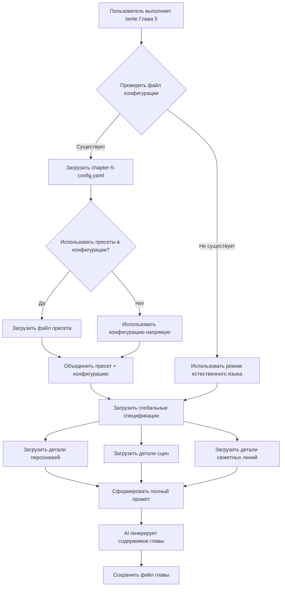

# Система конфигурации глав PRD

## Информация о документе

- **Название продукта**: Система конфигурации глав (Chapter Configuration System)
- **Версия**: v1.0.0
- **Дата создания**: 2025-10-14
- **Ответственные**: Novel Writer Team
- **Статус**: Стадия проектирования

---

## I. Предыстория и анализ проблем

### 1.1 Анализ текущей ситуации

**Текущая архитектура novel-writer-ru**:

```
Глобальная система спецификаций (✅ Завершена):
├── memory/novel-constitution.md      # Конституция творчества
├── stories/*/specification.md        # Спецификации историй
├── spec/tracking/
│   ├── character-state.json         # Отслеживание состояния персонажей
│   ├── relationships.json           # Сеть взаимоотношений
│   ├── plot-tracker.json            # Отслеживание сюжета
│   └── timeline.json                # Временная шкала

Процесс написания глав (❌ Требует оптимизации):
Пользователь вводит в AI-редакторе:
/write Глава 5

Ключевые моменты главы:
- Появляющиеся персонажи: Линь Чэнь, Су Вань
- Сцена: Конференц-зал компании
- Эмоция: Напряжение
- Тип сюжета: Демонстрация способностей
- Стиль: Быстрый темп, короткие предложения
- Объем: 3000 слов
```

**Выявленные проблемы**:

1. **Способ выражения параметров**: Чистый естественный язык, AI необходимо парсить, что легко приводит к упущениям или недопониманию.
2. **Повторяющаяся конфигурация**: Похожие сцены (например, несколько глав с действиями) требуют повторного описания.
3. **Обеспечение согласованности**: Зависит от памяти пользователя для поддержания единообразия стиля, легко возникают отклонения.
4. **Высокий порог входа для конфигурации**: Каждый раз нужно продумывать все параметры, увеличивая когнитивную нагрузку.
5. **Невозможность повторного использования**: Предыдущие конфигурации нельзя быстро применить к новым главам.

### 1.2 Сравнительный анализ: Платформа писательского мастерства Xingyue

**Подход Xingyue**:

```
Интерфейс веб-формы:
┌─────────────────────────┐
│ Номер главы: [5]          │
│ Заголовок: [Первые успехи] │
│                         │
│ Появляющиеся персонажи: (множественный выбор) │
│  ☑ Линь Чэнь (Главный герой) │
│  ☑ Су Вань (Главная героиня) │
│  ☐ Чжан Вэй (Коллега)      │
│                         │
│ Сцена: (выпадающий список) │
│  [Офис-Конференц-зал ▼]   │
│                         │
│ Быстрые пресеты: (опционально) │
│  [Сцена демонстрации способностей ▼] │
│  [Применить пресет]        │
│                         │
│ [Сгенерировать главу]     │
└─────────────────────────┘
```

**Анализ преимуществ**:

✅ **Структурированный ввод**: Выбор из выпадающего списка, флажки, четкие параметры.
✅ **Снижение порога входа**: Не нужно каждый раз продумывать все детали.
✅ **Система пресетов**: Быстрые опции (сцены действий, эмоциональные сцены и т. д.).
✅ **Визуализация**: Что видишь, то и получаешь.

**Анализ недостатков**:

❌ **Слабая согласованность**: Отсутствие глобальной системы спецификаций, зависит от памяти пользователя.
❌ **Отсутствие отслеживания**: Нет отслеживания состояния персонажей, сети взаимоотношений.
❌ **Невозможность отслеживания**: Исторические конфигурации недоступны для просмотра.
❌ **Ориентация на момент написания**: Каждая глава пишется независимо, без общего планирования.

### 1.3 Сущностное различие

**Разница не в полноте функций, а в способе ввода**:

| Аспект                      | novel-writer-ru         | Платформа Xingyue             | Разница               |
| --------------------------- | ----------------------- | ----------------------------- | --------------------- |
| Глобальные спецификации     | ✅ specification.md      | ❌ Нет                         | Мы сильнее            |
| Отслеживание персонажей     | ✅ character-state.json  | ❌ Нет                         | Мы сильнее            |
| Сеть взаимоотношений        | ✅ relationships.json    | ❌ Нет                         | Мы сильнее            |
| Управление временной шкалой | ✅ timeline.json         | ❌ Нет                         | Мы сильнее            |
| **Ввод параметров главы**   | ❌ **Естественный язык** | ✅ **Структурированная форма** | **Вот в чем разница** |
| Шаблоны пресетов            | ❌ Нет                   | ✅ Есть                        | Отсутствующая функция |

**Вывод**: Нам не хватает не глобальных конфигураций, а **структурированного управления параметрами на уровне глав**.

---

## II. Цели продукта

### 2.1 Основные цели

**Цель 1: Снизить порог входа для конфигурации глав**
- От «каждый раз нужно продумывать все параметры» к «быстрому выбору/повторному использованию конфигурации».
- Сократить время конфигурации пользователя на 50%.

**Цель 2: Сохранить философию «спецификационно-ориентированного творчества»**
- Усилить, а не заменить существующую систему.
- Конфигурация главы = Глобальные спецификации + Параметры главы.
- Конфигурационные файлы могут отслеживаться через Git и управляться версиями.

**Цель 3: Создать экосистему пресетов**
- Предоставить официальные пресеты (сцены действий, эмоциональные сцены и т. д.).
- Поддерживать пользовательские пресеты.
- Поддерживать обмен пресетами в сообществе.

### 2.2 Нецели (Not Goals)

❌ **Не** заменять глобальную систему спецификаций (specification.md и т. д.).
❌ **Не** требовать создания конфигурации для каждой главы.
❌ **Не** принуждать к использованию веб-интерфейса.
❌ **Не** изменять философию «спецификационно-ориентированного творчества».

### 2.3 Критерии успеха

**Количественные показатели**:
- Время создания конфигурации главы < 2 минут (против текущих 5-10 минут).
- Коэффициент повторного использования конфигураций > 30% (повторное использование конфигураций для однотипных глав).
- Коэффициент использования пресетов > 40% (использование официальных или пользовательских пресетов).
- Удовлетворенность пользователей > 4.5/5.0.

**Качественные показатели**:
- Отзывы пользователей: «Конфигурировать стало удобнее».
- Сокращение времени на освоение для новых пользователей.
- Повышение непрерывности творческого процесса (без прерывания мысли из-за конфигурации).

---

## III. Сценарии использования

### 3.1 Сценарий 1: Быстрое создание конфигурации главы (интерактивный CLI)

**Пользователь**: Автор Чжан Сан, пишет 5-ю главу.

**Процесс**:

```bash
# Шаг 1: Интерактивное создание конфигурации через CLI
$ novel chapter-config create 5 --interactive

┌─ 📝 Мастер настройки главы ─────────────────────┐
│ Номер главы: 5                             │
│ Заголовок: [Введите] Первые успехи              │
│                                       │
│ Выберите появляющихся персонажей (пробел для выбора, Enter для подтверждения):   │
│  [x] Линь Чэнь (Главный герой - Муж. - 24 года)         │
│  [x] Су Вань (Главная героиня - Жен. - 26 лет)         │
│  [ ] Чжан Вэй (Коллега - Муж. - 28 лет)         │
│                                       │
│ Выберите сцену:                              │
│  ( ) Офис-Рабочее место                       │
│  (*) Офис-Конференц-зал                     │
│  ( ) Кофейня                           │
│                                       │
│ Атмосфера/Эмоция:                              │
│  (*) Напряжение    ( ) Расслабленность                 │
│  ( ) Грусть    ( ) Воодушевление                 │
│                                       │
│ Тип сюжета:                              │
│  (*) Демонстрация способностей  ( ) Развитие отношений            │
│  ( ) Конфликт/Противостояние  ( ) Завязка интриги            │
│                                       │
│ Стиль письма:                              │
│  (*) Быстрый темп    ( ) Детальное описание            │
│  ( ) Диалоги в основном  ( ) Продвижение повествования            │
│                                       │
│ Целевой объем: [━━━━━●──] 3000 слов          │
│                                       │
│ [Подтвердить] [Отмена]                          │
└───────────────────────────────────────┘

✅ Конфигурация сохранена: stories/my-story/chapters/chapter-5-config.yaml
```

**Сгенерированный конфигурационный файл**:

```yaml
# stories/my-story/chapters/chapter-5-config.yaml
chapter: 5
title: Первые успехи

characters:
  - id: protagonist
    name: Линь Чэнь
    focus: high    # Ключевой персонаж главы
  - id: female-lead
    name: Су Вань
    focus: medium

scene:
  location_id: office-meeting-room
  location_name: Офис-Конференц-зал
  time: 10:00 утра
  atmosphere: tense

plot:
  type: ability_showcase
  summary: Главный герой решает проблему на техническом совещании, привлекая внимание главной героини.
  key_points:
    - Демонстрация навыков программирования
    - Первое привлечение внимания главной героини
    - Завязка линии злодея

style:
  pace: fast
  sentence_length: short
  focus: dialogue_action

wordcount:
  target: 3000
  min: 2500
  max: 3500

created_at: 2025-10-14T10:30:00Z
```

**Шаг 2: Написание в AI-редакторе**

```
Пользователь вводит в Claude Code:
/write Глава 5

AI автоматически выполняет:
1. Обнаруживает существование chapter-5-config.yaml
2. Загружает конфигурацию + глобальные спецификации (constitution.md, specification.md и т. д.)
3. Генерирует содержание главы на основе структурированных параметров
4. Сохраняет результат в stories/my-story/content/Глава 5.md
```

**Ценность**:
✅ Структурированные параметры, более точное понимание AI.
✅ Конфигурацию можно повторно использовать (например, для 10-й главы, если это тоже сцена демонстрации способностей).
✅ Отслеживается через Git, удобно для отката изменений.

### 3.2 Сценарий 2: Использование шаблона пресета

**Пользователь**: Автор Ли Сы, хочет написать напряженную боевую главу.

**Процесс**:

```bash
# Шаг 1: Просмотр доступных пресетов
$ novel preset list --category scene

📦 Доступные пресеты сцен:

  action-intense         Напряженная экшн-сцена
    Подходит для: драк, погонь и других высокоинтенсивных действий
    Стиль: быстрый темп, короткие предложения, плотное описание действий

  emotional-dialogue     Эмоциональная диалоговая сцена
    Подходит для: сцен признаний, ссор и других эмоциональных сцен
    Стиль: плотные диалоги, психологическое описание, тонкие эмоции

  mystery-suspense       Сцена нагнетания саспенса
    Подходит для: детективных расследований, закладывания зацепок
    Стиль: создание атмосферы, описание деталей, искусство недосказанности

# Шаг 2: Использование пресета для создания конфигурации
$ novel chapter-config create 8 --preset action-intense

✅ Применен пресет: action-intense
📝 Пожалуйста, дополните информацию о главе:

Появляющиеся персонажи: [Введите] Линь Чэнь, Злодей А
Сцена: [Введите] Заброшенный завод
Краткое описание сюжета: [Введите] Первая стычка главного героя со злодеем

✅ Конфигурация сохранена: stories/my-story/chapters/chapter-8-config.yaml
```

**Сгенерированная конфигурация (пресет + ввод пользователя)**:

```yaml
chapter: 8
title: Первая стычка

# Ввод пользователя
characters:
  - id: protagonist
    name: Линь Чэнь
    focus: high
  - id: villain-a
    name: Злодей А
    focus: high

scene:
  location: Заброшенный завод
  atmosphere: tense

plot:
  summary: Первая стычка главного героя со злодеем

# Наследуется из пресета
style:
  pace: fast                    # Пресет: Быстрый темп
  sentence_length: short        # Пресет: Короткие предложения
  focus: action_description     # Пресет: Описание действий

wordcount:
  target: 3000                  # Пресет: 2500-3500
  min: 2500
  max: 3500

special_requirements: |         # Требования к написанию из пресета
  - Короткие предложения, 15-25 слов каждое
  - Плотное описание действий, подчеркивающее ударную силу
  - Уменьшить количество мысленных процессов, сосредоточиться на действиях
  - Быстрое переключение сцен и ракурсов

preset_used: action-intense
```

**Ценность**:
✅ Значительно снижает порог входа, новички могут быстро начать.
✅ Обеспечивает единообразие стиля для данного типа сцен.
✅ Сообщество может создавать пресеты, формируя экосистему.

### 3.3 Сценарий 3: Повторное использование и изменение существующих конфигураций

**Пользователь**: Автор Ван У, 15-я глава похожа на 5-ю (обе сцены демонстрации способностей).

**Процесс**:

```bash
# Шаг 1: Просмотр истории конфигураций
$ novel chapter-config list

📋 Существующие конфигурации глав:

  Глава 5  Первые успехи  (Демонстрация способностей - Офис)
  Глава 8  Первая стычка  (Экшн-сцена - Заброшенный завод)
  Глава 12 Глубокое исследование  (Нагнетание саспенса - Подвал)

# Шаг 2: Повторное использование конфигурации
$ novel chapter-config copy 5 15

✅ Скопирована конфигурация Глава 5 → Глава 15
📝 Пожалуйста, измените отличия:

Заголовок: [Первые успехи] → [Введите] Потрясая всех
Сцена: [Офис-Конференц-зал] → [Введите] Корпоративная вечеринка
Краткое описание сюжета: [Сохранить/Изменить?] [Введите] Главный герой демонстрирует результаты проекта на корпоративной вечеринке

✅ Конфигурация сохранена: stories/my-story/chapters/chapter-15-config.yaml
```

**Ценность**:
✅ Быстрое повторное использование конфигураций для похожих сцен.
✅ Изменяются только отличия, экономя время.
✅ Сохраняется единообразие стиля для однотипных сцен.

### 3.4 Сценарий 4: Написание без конфигурации в AI-редакторе (обратная совместимость)

**Пользователь**: Опытный пользователь Чжао Лю, привыкший использовать естественный язык напрямую.

**Процесс**:

```
Пользователь вводит в AI-редакторе:
/write Глава 20

Ключевые моменты главы:
- Персонажи: Линь Чэнь, Су Вань
- Сцена: Побережье
- Эмоция: Легкость и романтика
- Сюжет: Признание в любви
- Объем: 2500 слов

AI выполняет:
1. Обнаруживает отсутствие chapter-20-config.yaml
2. Парсит описание на естественном языке (традиционный способ)
3. Загружает глобальные спецификации
4. Генерирует содержание главы

Опциональное уведомление:
💡 Обнаружено, что вы используете естественный язык для конфигурации. Хотите создать структурированную конфигурацию?
   $ novel chapter-config create 20 --from-prompt
```

**Ценность**:
✅ Полная обратная совместимость, не нарушает существующий рабочий процесс.
✅ Возможность выбора использования новой функции, без принуждения.
✅ Подсказки о новой функции направляют миграцию.

---

## IV. Дизайн функций

### 4.1 Формат конфигурационного файла главы (YAML Schema)

#### 4.1.1 Полное определение Schema

```yaml
# Полная структура конфигурационного файла главы
chapter: <number>           # Номер главы (обязательно)
title: <string>             # Заголовок главы (обязательно)
# Конфигурация персонажей
characters:
  - id: <string>            # ID персонажа (ссылка на character-profiles.md)
    name: <string>          # Имя персонажа
    focus: <high|medium|low>  # Степень важности персонажа в главе
    state_changes:          # Изменения состояния персонажа в главе (опционально)
      - ранен
      - настроение улучшилось

# Конфигурация сцены
scene:
  location_id: <string>     # ID локации (ссылка на locations.md)
  location_name: <string>   # Название локации
  time: <string>            # Время (например, "10 утра", "вечер")
  weather: <string>         # Погода (опционально)
  atmosphere: <tense|relaxed|sad|exciting>  # Атмосфера

# Конфигурация сюжета
plot:
  type: <enum>              # Тип сюжета (см. перечисление)
  summary: <string>         # Краткое содержание главы (обязательно)
  key_points:               # Ключевые моменты (массив)
    - <string>
  plotlines:                # Задействованные сюжетные линии (ссылка на specification.md)
    - PL-01
    - PL-02
  foreshadowing:            # Заложенные в главе предзнаменования (опционально)
    - id: F-005
      content: Упоминание таинственной организации

# Конфигурация стиля письма
style:
  pace: <fast|medium|slow>  # Темп
  sentence_length: <short|medium|long>  # Длина предложений
  focus: <action|dialogue|psychology|description>  # Фокус описания
  tone: <serious|humorous|dark|light>  # Тон (опционально)

# Требования к объему
wordcount:
  target: <number>          # Целевой объем
  min: <number>             # Минимальный объем
  max: <number>             # Максимальный объем

# Особые требования
special_requirements: |     # Другие особые требования к написанию (текстовый блок)
  - Требование 1
  - Требование 2

# Метаинформация
preset_used: <string>       # Использованный пресет (опционально)
created_at: <datetime>      # Время создания
updated_at: <datetime>      # Время обновления
```

#### 4.1.2 Перечисление типов сюжета

```yaml
plot_types:
  - ability_showcase      # Демонстрация способностей
  - relationship_dev      # Развитие отношений
  - conflict_combat       # Конфликт и противостояние
  - mystery_suspense      # Завязка тайны и саспенса
  - transition            # Переход и связка
  - climax                # Кульминация и решающая битва
  - emotional_scene       # Эмоциональная сцена
  - world_building        # Раскрытие мира
  - plot_twist            # Поворот сюжета
```

#### 4.1.3 Пример файла конфигурации

См. полный пример в каталоге `docs/prd/chapter/examples/`.

### 4.2 Проектирование команд CLI

#### 4.2.1 Список команд

```bash
# ========== Управление конфигурацией глав ==========
novel chapter-config create <chapter>       # Создать конфигурацию главы
  --interactive                              # Интерактивное создание (рекомендуется)
  --preset <preset-id>                       # Использовать пресет
  --from-prompt                              # Сгенерировать из естественного языка

novel chapter-config edit <chapter>         # Редактировать конфигурацию главы
  --editor <editor>                          # Указать редактор (по умолчанию vim)

novel chapter-config list                   # Вывести список всех конфигураций глав
  --format <table|json|yaml>                 # Формат вывода

novel chapter-config copy <from> <to>       # Копировать конфигурацию
  --interactive                              # Интерактивно изменить различия

novel chapter-config delete <chapter>       # Удалить конфигурацию

novel chapter-config validate <chapter>     # Проверить файл конфигурации

# ========== Управление пресетами ==========
novel preset list                           # Вывести список всех пресетов
  --category <scene|style|chapter>           # Фильтровать по категории

novel preset show <preset-id>               # Показать детали пресета

novel preset create <preset-id>             # Создать пользовательский пресет
  --interactive                              # Интерактивное создание

novel preset import <file>                  # Импортировать пресет сообщества

novel preset export <preset-id>             # Экспортировать пресет
  --output <file>                            # Выходной файл

# ========== Управление шаблонами конфигурации ==========
novel chapter-template list                 # Вывести список шаблонов конфигурации глав

novel chapter-template export <chapter>     # Экспортировать как шаблон
  --name <template-name>
```

#### 4.2.2 Детальный дизайн команд

**Команда 1: `novel chapter-config create`**

```typescript
interface CreateOptions {
  interactive?: boolean;    // Интерактивный режим
  preset?: string;         // ID используемого пресета
  fromPrompt?: boolean;    // Генерация из естественного языка
  characters?: string[];   // Указание персонажей
  scene?: string;          // Указание сцены
  plotType?: string;       // Тип сюжета
  wordcount?: number;      // Целевой объем
}

// Пример использования
$ novel chapter-config create 5 --interactive
$ novel chapter-config create 8 --preset action-intense
$ novel chapter-config create 10 --characters protagonist,female-lead --scene office
```

**Команда 2: `novel preset list`**

```bash
# Формат вывода
$ novel preset list --category scene

📦 Пресеты сцен (6 шт.):

  action-intense         Сцена напряженного действия
    Подходит для: драк, погонь и других высокоинтенсивных действий
    Стиль: быстрый темп, короткие предложения, интенсивные описания действий
    Объем: 2500-3500 слов

  emotional-dialogue     Сцена эмоционального диалога
    Подходит для: признаний, ссор и других эмоциональных сцен
    Стиль: насыщенные диалоги, психологические описания, тонкие эмоции
    Объем: 2000-3000 слов

  [Больше...]
```

### 4.3 Интеграция команд слэша (обновление шаблона write.md)

#### 4.3.1 Обновленный процесс write.md

```markdown
---
description: Выполнение написания главы на основе списка задач, автоматическая загрузка контекста и правил проверки
argument-hint: [Номер главы или ID задачи]
model: claude-sonnet-4-5-20250929
---

## Предварительные проверки

1. **Проверка файла конфигурации главы** (добавлено)
   - Проверить наличие файла `stories/*/chapters/chapter-X-config.yaml`
   - Если файл существует, загрузить конфигурацию
   - Распарсить конфигурацию главы, извлечь структурированные параметры

2. **Загрузка глобального контекста** (сохранено)
   - `memory/novel-constitution.md` (Конституция творчества - высшие принципы)
   - `memory/style-reference.md` (Справочник по стилю)
   - `stories/*/specification.md` (Спецификация истории)
   - `stories/*/creative-plan.md` (План творчества)
   - `spec/tracking/character-state.json` (Состояние персонажей)
   - `spec/tracking/relationships.json` (Сеть взаимоотношений)
   - Файлы, связанные с `spec/knowledge/`

3. **Загрузка подробной информации на основе конфигурации** (добавлено)
   ```
   Если конфигурация указывает:
   - characters: [protagonist, female-lead]
     → Загрузить подробные профили из spec/knowledge/character-profiles.md
     → Загрузить последнее состояние из spec/tracking/character-state.json

   - scene.location_id: office-meeting-room
     → Загрузить описание сцены из spec/knowledge/locations.md

   - plotlines: [PL-01, PL-02]
     → Загрузить детали сюжетных линий из stories/*/specification.md
   ```

## Процесс выполнения написания

### 1. Построение промпта для главы (добавлено внедрение структурированных параметров)

**При наличии файла конфигурации**:

```
📋 Конфигурация главы:

**Основная информация**:
- Глава: Глава 5 - Первые успехи
- Требования к объему: 2500-3500 слов (цель 3000 слов)

**Присутствующие персонажи**:
- Линь Чэнь (Главный герой - ключевой персонаж)
  Текущее состояние: [Чтение из character-state.json]
  Характер: [Чтение из character-profiles.md]

- Су Вань (Главная героиня - второстепенная роль)
  Текущее состояние: [Чтение]
  Характер: [Чтение]

**Настройка сцены**:
- Локация: Офис - конференц-зал
  Детали: [Чтение описания сцены из locations.md]
- Время: 10 утра
- Атмосфера: Напряженная

**Требования к сюжету**:
- Тип: Демонстрация способностей
- Краткое содержание: Главный герой решает техническую проблему на совещании, привлекая внимание главной героини
- Ключевые моменты:
  1. Демонстрация навыков программирования
  2. Первое привлечение внимания главной героини
  3. Задел для линии злодея

**Стиль письма**:
- Темп: Быстрый
- Длина предложений: Преимущественно короткие (15-25 слов)
- Фокус: Диалоги + описание действий
- Особые требования:
  - Технические описания должны быть точными, но не запутанными
  - Реакция главной героини должна быть тонкой
  - Оставить интригу в конце

[Затем загрузить глобальные спецификации...]
```

**При отсутствии файла конфигурации** (обратная совместимость):

```
📋 На основе описания пользователя:

[Парсинг естественного языка]

[Загрузка глобальных спецификаций...]
```

### 2. Генерация контента главы (сохранение исходного процесса)

### 3. Самопроверка качества (сохранение исходного процесса)

### 4. Сохранение и обновление (добавлена запись конфигурации)

- Сохранить контент главы в `stories/*/content/Глава X.md`
- Обновить временную метку `updated_at` в `chapter-X-config.yaml`
- Обновить статус задачи
```

#### 4.3.2 Приоритет загрузки конфигурации

```
Приоритет (Высокий → Низкий):

1. Файл конфигурации главы (chapter-X-config.yaml)
   └─ Параметры, специфичные для главы

2. Файл пресета (при использовании пресета)
   └─ Значения пресета по умолчанию

3. Глобальные спецификации (specification.md)
   └─ Настройки на уровне истории

4. Конституция творчества (novel-constitution.md)
   └─ Высшие принципы и ценности

5. Конституция творчества (novel-constitution.md)
   └─ Высшие принципы и ценности

Стратегия слияния:
- Конфигурация главы имеет приоритет над пресетом
- Пресет дополняет значения по умолчанию
- Глобальные спецификации предоставляют фон
- Конституция устанавливает принципы
```

### 4.4 Проектирование системы пресетов

#### 4.4.1 Структура файлов пресетов

```
~/.novel/presets/           # Библиотека пресетов в пользовательском каталоге
├── official/               # Официальные пресеты
│   ├── scenes/
│   │   ├── action-intense.yaml
│   │   ├── emotional-dialogue.yaml
│   │   └── mystery-suspense.yaml
│   ├── styles/
│   │   ├── fast-paced.yaml
│   │   └── detailed-narrative.yaml
│   └── chapters/
│       ├── opening.yaml
│       └── climax.yaml
├── user/                   # Пользовательские пресеты
│   └── my-battle-scene.yaml
└── community/              # Пресеты сообщества (загруженные из Dreams)
    └── popular-preset-1.yaml
```

#### 4.4.2 Формат файлов пресетов

```yaml
# ~/.novel/presets/official/scenes/action-intense.yaml
id: action-intense
name: Сцена напряженного действия
description: Подходит для описания драк, погонь и других высокоинтенсивных действий
category: scene
author: Novel Writer Official
version: 1.0.0

# Значения пресета по умолчанию
defaults:
  style:
    pace: fast
    sentence_length: short
    focus: action_description
    tone: serious

  wordcount:
    target: 3000
    min: 2500
    max: 3500

  special_requirements: |
    - Преимущественно короткие предложения, 15-25 слов в каждом
    - Интенсивное описание действий, подчеркивающее ощущение ударов и ритм
    - Минимизировать описание психологических состояний, сосредоточиться на действиях
    - Быстрое переключение сцен и точек зрения
    - Избегать излишне длинных описаний окружения

# Рекомендуемые настройки
recommended:
  plot_types:
    - conflict_combat
    - climax
  atmosphere:
    - tense
    - exciting

# Совместимость
compatible_genres:
  - xuanhuan
  - wuxia
  - dushi
  - kehuan

# Советы по использованию
usage_tips:
  - Подходит для кульминационных частей главы
  - Рекомендуется использовать с короткими главами (2000-3500 слов)
  - Требует предваряющей подготовки и последующего завершения
```

#### 4.4.3 Логика применения пресетов

```typescript
// Алгоритм применения пресета
function applyPreset(
  preset: Preset,
  userInput: Partial<ChapterConfig>
): ChapterConfig {
  return {
    // Ввод пользователя имеет наивысший приоритет
    ...preset.defaults,
    ...userInput,

    // Слияние special_requirements
    special_requirements: [
      preset.defaults.special_requirements,
      userInput.special_requirements
    ].filter(Boolean).join('\n\n'),

    // Запись пресета
    preset_used: preset.id,
  };
}
```

### 4.5 Правила проверки конфигурации

#### 4.5.1 Список проверок

```typescript
interface ValidationRules {
  // Проверка обязательных полей
  required_fields: [
    'chapter',
    'title',
    'plot.summary',
    'wordcount.target'
  ];

  // Проверка типов данных
  type_checks: {
    chapter: 'number',
    title: 'string',
    'characters[].focus': ['high', 'medium', 'low'],
    'style.pace': ['fast', 'medium', 'slow'],
    // ...
  };

  // Проверка целостности ссылок
  reference_checks: {
    'characters[].id': 'character-profiles.md',
    'scene.location_id': 'locations.md',
    'plot.plotlines[]': 'specification.md',
  };

  // Проверка логической согласованности
  logic_checks: [
    'wordcount.min <= wordcount.target <= wordcount.max',
    'characters.length >= 1',
    'plot.key_points.length >= 1'
  ];
}
```

#### 4.5.2 Сообщения об ошибках проверки

```bash
$ novel chapter-config validate 5

🔍 Проверка файла конфигурации: chapter-5-config.yaml

❌ Проверка не пройдена (2 ошибки):

  1. Ошибка ссылки (characters[1].id)
     └─ ID персонажа "unknown-person" отсутствует в character-profiles.md
     Предложение: Проверьте профиль персонажа или исправьте ID

  2. Логическая ошибка (wordcount)
     └─ min(3500) > target(3000)
     Предложение: Отрегулируйте диапазон объема так, чтобы min <= target <= max

⚠️  Предупреждение (1):

  1. Лучшая практика (plot.key_points)
     └─ Рекомендуется иметь как минимум 3 ключевых момента, сейчас их 2
```

---

## Пять. Техническое решение

### 5.1 Проектирование структуры файлов

```
Структура проекта:

stories/
  └── my-story/
      ├── specification.md           # Глобальные спецификации (существуют)
      ├── creative-plan.md           # План творчества (существует)
      ├── chapters/                  # 🆕 Каталог конфигурации глав
      │   ├── chapter-1-config.yaml
      │   ├── chapter-2-config.yaml
      │   ├── chapter-5-config.yaml
      │   └── ...
      └── content/                   # Содержимое глав (существует)
          ├── 第1章.md
          ├── 第2章.md
          └── ...

Библиотека пресетов:

~/.novel/presets/                  # 🆕 Глобальный каталог пресетов
├── official/                      # Официальные пресеты
│   ├── scenes/
│   ├── styles/
│   └── chapters/
├── user/                          # Пользовательские пресеты
└── community/                     # Пресеты сообщества

node_modules/novel-writer-ru/      # Встроенные пакеты npm
└── presets/                       # Встроенные официальные пресеты
    ├── action-intense.yaml
    ├── emotional-dialogue.yaml
    └── ...
```

### 5.2 Процесс загрузки конфигурации


```mermaid
graph TD
    A[Пользователь выполняет /write Глава 5] --> B{Проверить файл конфигурации}
    B -->|Существует| C[Загрузить chapter-5-config.yaml]
    B -->|Не существует| D[Использовать режим естественного языка]

    C --> E{Использовать пресеты в конфигурации?}
    E -->|Да| F[Загрузить файл пресета]
    E -->|Нет| G[Использовать конфигурацию напрямую]

    F --> H[Объединить пресет + конфигурацию]
    G --> H
    H --> I[Загрузить глобальные спецификации]

    D --> I

    I --> J[Загрузить детали персонажей]
    I --> K[Загрузить детали сцен]
    I --> L[Загрузить детали сюжетных линий]

    J --> M[Сформировать полный промпт]
    K --> M
    L --> M

    M --> N[AI генерирует содержимое главы]
    N --> O[Сохранить файл главы]
```

### 5.3 Точки интеграции с существующей системой

#### 5.3.1 Интеграция с шаблоном write.md

**Изменение 1: Шаг предварительной проверки**

```markdown
## Предварительная проверка

1. Запустить скрипт `{SCRIPT}` для проверки статуса творчества

2. **🆕 Проверить файл конфигурации главы**
   ```bash
   config_file="stories/*/chapters/chapter-$CHAPTER-config.yaml"
   if [ -f "$config_file" ]; then
     echo "✅ Файл конфигурации найден, загрузка..."
     # Распарсить YAML и извлечь параметры
   else
     echo "ℹ️  Файл конфигурации не найден, используется режим естественного языка"
   fi
   ```

3. Запросить документы (документы наивысшего приоритета)
   - `memory/novel-constitution.md`
   - ... (сохранить как есть)
```

**Изменение 2: Построение промпта**

```markdown
### Построение промпта для написания главы

**Если есть файл конфигурации**:
```
📋 Конфигурация главы:
[Внедрение структурированных параметров]

**Основная информация**:
- Глава: Глава {{chapter}} - {{title}}
- Объем: {{wordcount.min}}-{{wordcount.max}} слов (цель {{wordcount.target}} слов)

**Появляющиеся персонажи** ({{characters.length}} чел.):
{{#each characters}}
- {{name}} ({{role}} - {{focus}} фокус)
  Характер: [Чтение из character-profiles.md]
  Текущее состояние: [Чтение из character-state.json]
{{/each}}

...
```

**Если нет файла конфигурации** (обратная совместимость):
```
📋 На основе ввода пользователя:
[Сохранить исходный парсинг естественного языка]
```
```

#### 5.3.2 Интеграция с character-state.json

```typescript
// Ссылка на ID персонажа в файле конфигурации
characters:
  - id: protagonist    // Ссылка на ID
    name: Лин Чен
    focus: high

// При загрузке AI
1. Прочитать spec/knowledge/character-profiles.md
   → Найти полный профиль protagonist

2. Прочитать spec/tracking/character-state.json
   → Получить последнее состояние
   {
     "protagonist": {
       "location": "Офис",
       "health": "Хорошее",
       "mood": "Уверенный",
       "relationships": {
         "female-lead": "Знакомство, есть симпатия"
       }
     }
   }

3. Объединить информацию и внедрить в промпт
```

#### 5.3.3 Интеграция с specification.md (система сюжетных линий)

```yaml
# Указание участвующих сюжетных линий в файле конфигурации
plot:
  plotlines:
    - PL-01    # Основная линия: развитие карьеры
    - PL-02    # Побочная линия: любовная линия

# При загрузке AI
1. Прочитать определения сюжетных линий из stories/*/specification.md
2. Извлечь подробную информацию для PL-01 и PL-02
3. Убедиться, что данная глава продвигает эти две линии
4. После написания обновить spec/tracking/plot-tracker.json
```

### 5.4 Основные моменты реализации CLI (TypeScript)

#### 5.4.1 Проектирование основного класса

```typescript
// src/core/chapter-config.ts

import yaml from 'js-yaml';
import fs from 'fs-extra';
import path from 'path';

/**
 * Менеджер конфигурации глав
 */
export class ChapterConfigManager {
  constructor(private projectPath: string) {}

  /**
   * Создание конфигурации главы
   */
  async createConfig(
    chapter: number,
    options: CreateConfigOptions
  ): Promise<ChapterConfig> {
    const config: ChapterConfig = {
      chapter,
      title: options.title || `Глава ${chapter}`,
      characters: [],
      scene: {},
      plot: {
        type: options.plotType || 'transition',
        summary: '',
        key_points: []
      },
      style: {
        pace: 'medium',
        sentence_length: 'medium',
        focus: 'balanced'
      },
      wordcount: {
        target: 3000,
        min: 2500,
        max: 3500
      },
      created_at: new Date().toISOString()
    };

    // Если используется пресет
    if (options.preset) {
      const preset = await this.loadPreset(options.preset);
      Object.assign(config, this.applyPreset(preset, config));
    }

    // Сохранение файла конфигурации
    const configPath = this.getConfigPath(chapter);
    await fs.writeFile(
      configPath,
      yaml.dump(config, { indent: 2 })
    );

    return config;
  }

  /**
   * Загрузка конфигурации главы
   */
  async loadConfig(chapter: number): Promise<ChapterConfig | null> {
    const configPath = this.getConfigPath(chapter);
    if (!await fs.pathExists(configPath)) {
      return null;
    }

    const content = await fs.readFile(configPath, 'utf-8');
    return yaml.load(content) as ChapterConfig;
  }

  /**
   * Валидация конфигурации
   */
  async validateConfig(chapter: number): Promise<ValidationResult> {
    const config = await this.loadConfig(chapter);
    if (!config) {
      return {
        valid: false,
        errors: ['Файл конфигурации не существует']
      };
    }

    const errors: string[] = [];
    const warnings: string[] = [];

    // Проверка обязательных полей
    if (!config.title) errors.push('Отсутствует заголовок');
    if (!config.plot.summary) errors.push('Отсутствует краткое изложение сюжета');

    // Проверка целостности ссылок
    for (const char of config.characters || []) {
      const exists = await this.checkCharacterExists(char.id);
      if (!exists) {
        errors.push(`ID персонажа "${char.id}" не существует`);
      }
    }

    // Проверка логической согласованности
    const { min, target, max } = config.wordcount;
    if (min > target || target > max) {
      errors.push('Некорректный диапазон количества слов');
    }

    // Предупреждения о лучших практиках
    if ((config.plot.key_points?.length || 0) < 3) {
      warnings.push('Рекомендуется указать как минимум 3 ключевых момента');
    }

    return {
      valid: errors.length === 0,
      errors,
      warnings
    };
  }

  /**
   * Список всех конфигураций
   */
  async listConfigs(): Promise<ChapterConfigSummary[]> {
    const chaptersDir = path.join(
      this.projectPath,
      'stories',
      '*',
      'chapters'
    );

    // Реализация опущена...
  }

  private getConfigPath(chapter: number): string {
    // Реализация опущена...
  }

  private async loadPreset(presetId: string): Promise<Preset> {
    // Реализация опущена...
  }

  private applyPreset(
    preset: Preset,
    config: ChapterConfig
  ): Partial<ChapterConfig> {
    // Реализация опущена...
  }

  private async checkCharacterExists(id: string): Promise<boolean> {
    // Реализация опущена...
  }
}
```

#### 5.4.2 Интерактивная реализация CLI

```typescript
// src/commands/chapter-config.ts

import inquirer from 'inquirer';
import { ChapterConfigManager } from '../core/chapter-config.js';

export async function createConfigInteractive(
  chapter: number
): Promise<void> {
  const manager = new ChapterConfigManager(process.cwd());

  // Загрузка доступных ресурсов
  const characters = await loadAvailableCharacters();
  const scenes = await loadAvailableScenes();

  // Интерактивный опрос
  const answers = await inquirer.prompt([
    {
      type: 'input',
      name: 'title',
      message: 'Заголовок главы:',
      validate: (input) => input.length > 0
    },
    {
      type: 'checkbox',
      name: 'characters',
      message: 'Выберите появляющихся персонажей (пробел для выбора, Enter для подтверждения):',
      choices: characters.map(c => ({
        name: `${c.name} (${c.role} - ${c.gender} - ${c.age} лет)`,
        value: c.id
      }))
    },
    {
      type: 'list',
      name: 'scene',
      message: 'Выберите сцену:',
      choices: scenes.map(s => ({
        name: s.name,
        value: s.id
      }))
    },
    {
      type: 'list',
      name: 'atmosphere',
      message: 'Атмосфера/настроение:',
      choices: [
        { name: 'Напряженная', value: 'tense' },
        { name: 'Расслабленная', value: 'relaxed' },
        { name: 'Грустная', value: 'sad' },
        { name: 'Воодушевляющая', value: 'exciting' }
      ]
    },
    {
      type: 'list',
      name: 'plotType',
      message: 'Тип сюжета:',
      choices: [
        { name: 'Демонстрация способностей', value: 'ability_showcase' },
        { name: 'Развитие отношений', value: 'relationship_dev' },
        { name: 'Конфронтация', value: 'conflict_combat' },
        { name: 'Создание интриги', value: 'mystery_suspense' }
      ]
    },
    {
      type: 'list',
      name: 'pace',
      message: 'Стиль письма:',
      choices: [
        { name: 'Быстрый темп', value: 'fast' },
        { name: 'Детальное описание', value: 'detailed' },
        { name: 'Преимущественно диалоги', value: 'dialogue' },
        { name: 'Повествование', value: 'narrative' }
      ]
    },
    {
      type: 'number',
      name: 'wordcount',
      message: 'Целевое количество слов:',
      default: 3000,
      validate: (input) => input >= 1000 && input <= 10000
    }
  ]);

  // Создание конфигурации
  const config = await manager.createConfig(chapter, {
    title: answers.title,
    characters: answers.characters,
    scene: answers.scene,
    atmosphere: answers.atmosphere,
    plotType: answers.plotType,
    style: { pace: answers.pace },
    wordcount: {
      target: answers.wordcount,
      min: Math.floor(answers.wordcount * 0.8),
      max: Math.floor(answers.wordcount * 1.2)
    }
  });

  console.log(chalk.green(`\n✅ Конфигурация сохранена: ${getConfigPath(chapter)}`));
}
```

### 5.5 Проектирование библиотеки пресетов

#### 5.5.1 Встроенный список пресетов

**Пресеты сцен (6 шт.)**:
1. `action-intense` - Сцена напряженного действия
2. `emotional-dialogue` - Сцена эмоционального диалога
3. `mystery-suspense` - Сцена создания интриги
4. `world-building` - Сцена раскрытия мироустройства
5. `comedic-relief` - Сцена для разрядки юмором
6. `transition` - Сцена для перехода

**Пресеты стиля (4 шт.)**:
1. `fast-paced` - Быстрый темп письма
2. `detailed-narrative` - Детальное повествование
3. `dialogue-heavy` - Преобладание диалогов
4. `psychological-deep` - Глубокое психологическое описание

**Пресеты глав (4 шт.)**:
1. `opening-chapter` - Начальная глава
2. `climax-chapter` - Кульминационная глава
3. `turning-point` - Поворотная глава
4. `ending-chapter` - Заключительная глава

#### 5.5.2 Приоритет загрузки пресетов

```
Порядок загрузки:

1. Локальные пресеты проекта
   stories/*/presets/*.yaml

2. Пользовательские пресеты
   ~/.novel/presets/user/*.yaml

3. Пресеты сообщества
   ~/.novel/presets/community/*.yaml

4. Официальные пресеты
   ~/.novel/presets/official/*.yaml

5. Встроенные пресеты
   node_modules/novel-writer-ru/presets/*.yaml

Правило: Пресеты с одинаковыми именами, имеющие более высокий приоритет, перезаписывают более низкие.
```

---

## Шесть. Интеграция с Dreams (долгосрочное планирование)

### 6.1 Архитектура интеграции

```
┌────────── Dreams Web ──────────┐
│                                │
│  📝 Форма конфигурации главы     │
│  - Выбор персонажа (из библиотеки) │
│  - Выбор сцены (из библиотеки)   │
│  - Конфигурация стиля (выпадающий список/одиночный выбор) │
│  - Выбор пресета (рекомендуемые пресеты) │
│                                │
│  [Сохранить конфигурацию] [Синхронизировать с локальной] │
│                                │
└────────┬───────────────────────┘
         │
         │ API: POST /api/chapter-config
         │ Response: { configId, yamlContent }
         ↓
┌────────── Синхронизация CLI ──────────┐
│                                      │
│  $ novel sync chapter 5              │
│                                      │
│  1. Вызов Dreams API                 │
│  2. Загрузка конфигурации YAML        │
│  3. Сохранение локально             │
│     stories/*/chapters/              │
│                                      │
└────────┬─────────────────────────────┘
         │
         │ Локальные файлы
         ↓
┌──── AI Редактор (Claude Code) ────┐
│                                      │
│  Ввод пользователя: /write Глава 5   │
│                                      │
│  Действия AI:                        │
│  1. Чтение chapter-5-config.yaml    │
│  2. Загрузка глобальных спецификаций │
│  3. Генерация контента главы         │
│                                      │
└──────────────────────────────────────┘
```

### 6.2 Дизайн функции Dreams

#### 6.2.1 Страница формы конфигурации главы

**Путь к странице**: `https://dreams.wordflowlab.com/chapter-config/create`

**Модули функции**:

1. **Основная информация**
   - Номер главы (поле ввода)
   - Заголовок (поле ввода)

2. **Выбор персонажей**
   - Загрузка из библиотеки персонажей пользователя (`character-profiles.md`)
   - Множественный выбор, отображение имени персонажа, пола, возраста, роли
   - Возможность установить долю участия для каждого персонажа (high/medium/low)

3. **Настройка сцены**
   - Загрузка из библиотеки сцен (`locations.md`)
   - Выбор из выпадающего списка
   - Предварительный просмотр деталей сцены
   - Возможность быстрого создания новой сцены

4. **Настройка сюжета**
   - Тип сюжета (одиночный выбор)
   - Краткое описание сюжета (текстовое поле)
   - Ключевые моменты (динамический список)
   - Задействованные сюжетные линии (множественный выбор, загрузка из specification.md)

5. **Настройка стиля**
   - Темп (одиночный выбор: быстрый/средний/медленный)
   - Длина предложений (одиночный выбор: короткие/средние/длинные)
   - Фокус описания (одиночный выбор: действие/диалог/психология/описание)
   - Целевое количество слов (слайдер: 1000-10000)

6. **Система пресетов**
   - Список рекомендуемых пресетов (на основе типа сюжета)
   - Предварительный просмотр пресетов
   - Применение пресетов в один клик

#### 6.2.2 Дизайн механизма синхронизации

**Вариант 1: Синхронизация в реальном времени**

```typescript
// Пользователь нажимает "Синхронизировать с локальным" в Dreams
POST /api/chapter-config/sync
Request: {
  configId: "abc123",
  projectPath: "/Users/user/my-story"
}

Response: {
  success: true,
  yamlContent: "...",  // Содержимое файла конфигурации
  localPath: "stories/my-story/chapters/chapter-5-config.yaml"
}

// CLI получает и сохраняет
$ novel sync chapter 5 --from-web abc123

✅ Конфигурация синхронизирована локально
📁 stories/my-story/chapters/chapter-5-config.yaml
```

**Вариант 2: Механизм сессии (рекомендуется)**

```typescript
// 1. Пользователь создает конфигурацию в Dreams
POST /api/chapter-config/create
Response: {
  sessionId: "sess_xyz789",
  expiresIn: 1800  // 30 минут
}

// 2. CLI опрашивает или получает напрямую
$ novel write 5 --web-session sess_xyz789

// 3. CLI вызывает API для получения конфигурации
GET /api/sessions/sess_xyz789
Response: {
  chapterConfig: { ... },  // Объект YAML
  projectInfo: { ... }
}

// 4. CLI генерирует локальный файл конфигурации и запускает написание
```

### 6.3 Дизайн API Dreams

```typescript
// Спецификация API Dreams

/**
 * Создание конфигурации главы
 */
POST /api/chapter-config
Request: ChapterConfig
Response: {
  id: string;
  yamlContent: string;
  createdAt: string;
}

/**
 * Получение конфигурации главы
 */
GET /api/chapter-config/:id
Response: ChapterConfig

/**
 * Создание сессии (для использования CLI)
 */
POST /api/chapter-config/:id/session
Response: {
  sessionId: string;
  expiresAt: string;
  downloadUrl: string;
}

/**
 * Получение данных сессии
 */
GET /api/sessions/:sessionId
Response: {
  config: ChapterConfig;
  metadata: {
    projectName: string;
    chapterNumber: number;
  }
}

/**
 * Синхронизация с локальным проектом
 */
POST /api/sync/chapter-config
Request: {
  configId: string;
  projectToken: string;  // Токен аутентификации проекта
}
Response: {
  success: boolean;
  localPath: string;
}
```

### 6.4 Приоритеты интеграции

**Этап 1 (Краткосрочный)**: Полностью локальный CLI
- Реализация системы конфигурации глав
- Реализация системы пресетов
- Обновление шаблона write.md

**Этап 2 (Среднесрочный)**: Базовая интеграция с Dreams
- Страница формы конфигурации в Dreams
- Механизм сессий
- Команда синхронизации CLI

**Этап 3 (Долгосрочный)**: Полная экосистема
- Управление облачными конфигурациями
- Совместное использование пресетов сообществом
- Визуальный редактор конфигураций

---

## Семь. План реализации

### 7.1 Разделение на этапы

#### Этап 1: Основная система конфигурации (2-3 дня)

**Цель**: Реализация создания, загрузки и валидации файлов конфигурации глав

**Результаты**:
- [ ] Определение схемы YAML для конфигурации глав
- [ ] Основной класс ChapterConfigManager
- [ ] Команды CLI: `chapter-config create/edit/list/validate`
- [ ] Примеры файлов конфигурации (5 шт.)
- [ ] Модульные тесты

**Критерии приемки**:
- Возможность создания файла конфигурации через CLI
- Корректная валидация файла конфигурации
- Корректная работа функции вывода списка всех конфигураций

#### Этап 2: Система пресетов (1-2 дня)

**Цель**: Реализация библиотеки пресетов и механизма их применения

**Результаты**:
- [ ] Определение формата файлов пресетов
- [ ] Основной класс PresetManager
- [ ] Команды CLI: `preset list/show/create/import/export`
- [ ] Встроенные пресеты (14 шт.)
- [ ] Логика применения пресетов

**Критерии приемки**:
- Возможность вывода списка и просмотра пресетов
- Возможность создания конфигурации с использованием пресетов
- Корректное применение пресетов

#### Этап 3: Интеграция с write.md (1 день)

**Цель**: Обновление шаблона write.md для поддержки загрузки конфигураций

**Результаты**:
- [ ] Обновление шагов предварительной проверки шаблона write.md
- [ ] Логика загрузки конфигурации
- [ ] Внедрение структурированных параметров в шаблон
- [ ] Тестирование обратной совместимости

**Критерии приемки**:
- AI корректно загружает конфигурацию
- Сохранение прежнего поведения при отсутствии конфигурации
- Сгенерированный контент главы соответствует требованиям конфигурации

#### Этап 4: Интерактивный CLI (1 день)

**Цель**: Реализация удобного интерактивного создания конфигурации

**Результаты**:
- [ ] Интерактивный процесс создания
- [ ] Интерфейс выбора персонажей
- [ ] Интерфейс выбора сцен
- [ ] Предварительный просмотр и подтверждение в реальном времени

**Критерии приемки**:
- Интерактивный процесс проходит гладко
- Корректная загрузка библиотек персонажей и сцен
- Сгенерированная конфигурация соответствует ожиданиям

#### Этап 5: Документация и примеры (1 день)

**Цель**: Доработка документации и примеров использования

**Результаты**:
- [ ] Руководство пользователя
- [ ] Документация API
- [ ] Библиотека примеров конфигураций
- [ ] Видеоурок (опционально)

**Критерии приемки**:
- Документация полная и понятная
- Примеры готовы к использованию
- Новые пользователи могут быстро начать работу

### 7.2 Ресурсы разработки

**Разработчики**:
- Backend разработка: 1 человек (основная система, команды CLI)
- Frontend разработка: 0 человек (в настоящее время не требуется)
- Тестирование: 0.5 человека (модульное тестирование, интеграционное тестирование)
- Документация: 0.5 человека (написание документации)

**Оценка общего объема работ**:
- Этап 1: 16-24 часа
- Этап 2: 8-16 часов
- Этап 3: 8 часов
- Этап 4: 8 часов
- Этап 5: 8 часов
- **Итого**: 48-64 часа (примерно 6-8 рабочих дней)

### 7.3 Оценка рисков

| Риск                                         | Вероятность | Влияние | Меры по устранению                                                                    |
| -------------------------------------------- | ----------- | ------- | ------------------------------------------------------------------------------------- |
| Необоснованный дизайн формата конфигурации   | Средняя     | Высокое | Тщательное исследование на начальном этапе, предоставление примеров, быстрая итерация |
| Сложность интеграции с существующей системой | Средняя     | Среднее | Постепенная интеграция, поддержание обратной совместимости                            |
| Крутая кривая обучения для пользователей     | Низкая      | Среднее | Предоставление интерактивного CLI, обширной документации и примеров                   |
| Негибкий дизайн системы пресетов             | Низкая      | Среднее | Поддержка пользовательских настроек, вклад сообщества                                 |

---

## Восемь. Критерии успеха

### 8.1 Количественные показатели

| Показатель                                        | Текущее значение | Целевое значение | Способ измерения                                          |
| ------------------------------------------------- | ---------------- | ---------------- | --------------------------------------------------------- |
| Время на конфигурацию главы                       | 5-10 минут       | < 2 минут        | Тестирование с замером времени у пользователей            |
| Коэффициент повторного использования конфигураций | 0%               | > 30%            | Статистика использования команды повторного использования |
| Коэффициент использования пресетов                | 0%               | > 40%            | Статистика количества применений пресетов                 |
| Удовлетворенность пользователей                   | Н/А              | > 4.5/5.0        | Опрос пользователей                                       |
| Время на освоение для новых пользователей         | 30 минут         | < 15 минут       | Тестирование с наблюдением за новыми пользователями       |

### 8.2 Качественные показатели

**Отзывы пользователей**:
- «Конфигурировать стало проще, не нужно каждый раз продумывать все детали»
- «Система пресетов очень полезна, частые сценарии настраиваются в один клик»
- «Файлы конфигурации можно версионировать, удобно отслеживать изменения»
- «Интерактивный CLI очень удобен, новички быстро осваивают»

**Технические показатели**:
- Покрытие кода > 80%
- Успешность валидации конфигураций > 95%
- Время отклика CLI < 500 мс
- Успешность загрузки файлов конфигурации > 99%

---

## Девять. Дальнейшее развитие

### 9.1 Краткосрочная оптимизация (3-6 месяцев)

1. **Развитие экосистемы пресетов**
   - Расширение официальной библиотеки пресетов до 50+
   - Открытие канала для внесения пресетов сообществом
   - Система оценки и рекомендаций пресетов

2. **Система шаблонов конфигураций**
   - Поддержка шаблонов конфигураций (шаблоны для нескольких глав)
   - Замена переменных в шаблонах
   - Массовое применение шаблонов

3. **Интеллектуальные рекомендации**
   - Рекомендация пресетов на основе существующих конфигураций
   - Анализ стиля письма для рекомендации конфигураций
   - Обучение на привычках пользователя для персонализированных предложений

### 9.2 Среднесрочное планирование (6-12 месяцев)

1. **Интеграция с Dreams Web**
   - Визуальный редактор конфигураций
   - Управление облачными конфигурациями
   - Механизм синхронизации через сессии

2. **Визуализация конфигураций**
   - Визуальное редактирование файлов конфигурации
   - Сравнение и отображение различий конфигураций
   - Отслеживание истории конфигураций

3. **Командная работа**
   - Общая библиотека пресетов
   - Стандарты конфигурации для команды
   - Управление правами доступа к конфигурациям

### 9.3 Долгосрочное видение (12+ месяцев)

1. **AI-ассистент для конфигураций**
   - Автоматическая рекомендация конфигураций на основе сюжета
   - Интеллектуальное заполнение параметров конфигурации
   - Предложения по оптимизации конфигураций

2. **Экосистема сообщества**
   - Маркетплейс пресетов (покупка/продажа пресетов)
   - Торговля шаблонами конфигураций
   - Сертификация и рекомендации экспертов

3. **Кроссплатформенная поддержка**
   - Плагин для VSCode (визуальная конфигурация)
   - Конфигурация на мобильных устройствах (быстрое создание)
   - Плагин для браузера (конфигурация в веб)

---

## Десять. Приложения

### 10.1 Связанные документы

- [Детальная техническая спецификация](./tech-spec.md)
- [Библиотека примеров конфигураций](./examples/)
- [План интеграции с Dreams](./integration-plan.md)
- [Руководство пользователя](../commands.md#система-конфигурации-глав)

### 10.2 История изменений

| Версия | Дата       | Изменения                   | Автор             |
| ------ | ---------- | --------------------------- | ----------------- |
| v1.0.0 | 2025-10-14 | Исходная версия, полный PRD | Novel Writer Team |

### 10.3 Справочные материалы

- [Платформа для письма Xingyue](https://example.com) - Анализ конкурентов
- [Спецификация YAML](https://yaml.org/spec/1.2.2/) - Формат файлов конфигурации
- [Inquirer.js](https://github.com/SBoudrias/Inquirer.js) - Библиотека для интерактивного CLI
- [Существующая архитектура novel-writer-ru](../../README.md)

---

## Записи об утверждении

| Роль                      | Имя | Заключение | Дата |
| ------------------------- | --- | ---------- | ---- |
| Руководитель продукта     | -   | -          | -    |
| Технический руководитель  | -   | -          | -    |
| Руководитель тестирования | -   | -          | -    |

---

**КОНЕЦ PRD**