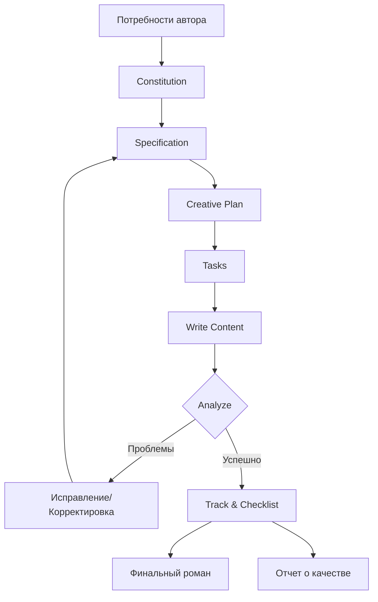

# Техническая документация Novel Writer

## Обзор

Novel Writer — это инструмент для создания романов на основе **спецификационно-ориентированной разработки (Specification-Driven Development, SDD)** с использованием ИИ. Он применяет лучшие практики разработки программного обеспечения к творческому письму, используя систематический семишаговый методологический подход и помощь ИИ для создания высококачественных китайских романов.

**Основные принципы**:
- 📋 **Управление на основе спецификаций** — пишите спецификации романа, как PRD
- 🤖 **Усиление ИИ** — глубокая интеграция с 13 платформами ИИ
- 🔄 **Итеративная оптимизация** — постоянная проверка, отслеживание и улучшение
- ✅ **Обеспечение качества** — комплексная система проверки и отслеживания

---

## Архитектурная диаграмма


---

## Основные компоненты

### 1. Инструмент CLI (novel-writer-cn)

**Технологический стек**:
- **Язык**: TypeScript (Node.js 18+)
- **Сборка**: `tsc` + `tsx`
- **Зависимости**:
  - `commander` — фреймворк CLI
  - `inquirer` — интерактивные опросы
  - `chalk` — цвета терминала
  - `fs-extra` — операции с файлами
  - `js-yaml` — парсер YAML/TOML
  - `ora` — анимация загрузки

**Основные функции**:
```bash
novel init [name]          # Инициализация проекта
novel upgrade              # Обновление проекта до последней версии
novel plugins add/remove   # Управление плагинами
novel check                # Проверка состояния проекта
```

### 2. Интеграция с платформами ИИ

Поддерживает **13 платформ ИИ**, обеспечивая совместимость с различными форматами команд и конфигурационными файлами:

| Тип платформы | Формат конфигурации | Формат команды | Пример платформы |
|---------------|-------------------|----------------|-------------------|
| **Чистый Markdown** | Без frontmatter | `/имя-команды` | Cursor, GitHub Copilot, CodeBuddy |
| **Минимальный frontmatter** | Поле description | `/имя-команды` | OpenCode |
| **Частичный frontmatter** | description + argument-hint | `/имя-команды` | Roo Code, Windsurf, Kilo Code |
| **Полный frontmatter** | Все поля | `/novel.имя-команды` | Claude Code |
| **Формат TOML** | description + prompt | `/novel/имя-команды` | Gemini CLI, Qwen Code |

**Система сборки** (`scripts/build/generate-commands.sh`):
- Генерирует все команды платформы из единого источника в `templates/commands/`
- Автоматически адаптирует формат под требования каждой платформы
- Поддерживает добавление команд плагинов

### 3. Система плагинов

**Механизм плагинов**:
- **Расположение**: `src/plugins/` (ядро) + `templates/plugins/` (шаблоны)
- **Типы**:
  - Улучшение письма: `authentic-voice` (аутентичный голос)
  - Имитация стиля: `luyao-style`, `wangyu-style`
  - Инструменты: `translate`, `book-analysis`

**Процесс установки плагина**:
```
novel plugins add <имя>
  ↓
1. Копирование команд плагина в проект .claude/commands/ и т.д.
2. Копирование шаблонов конфигурации в .specify/memory/
3. Обновление метаданных проекта
```

---

## Подробное описание семишаговой методологии

### Основной рабочий процесс

```
1. Constitution  →  Определение конституции творчества (высшие принципы)
2. Specify       →  Написание спецификаций истории (единый источник истины)
3. Clarify       →  Уточнение неопределенных решений (5 ключевых вопросов)
4. Plan          →  Составление плана творчества (структура глав)
5. Tasks         →  Разбивка на список задач (выполнимые шаги)
6. Write         →  Выполнение создания глав (помощь ИИ в написании)
7. Analyze       →  Комплексная проверка и анализ (двухрежимный интеллект)
```

### Многоуровневое рекурсивное применение

SDD — это не линейный процесс, а **многоуровневое рекурсивное** применение:

| Уровень | Specify | Plan | Tasks | Write | Analyze |
|---------|---------|------|-------|-------|---------|
| **Вся книга** | ✅ | ✅ | ✅ | - | ✅ |
| **Том** | ✅ | ✅ | ✅ | ✅ | ✅ |
| **Секция главы** | ✅ | ✅ | ✅ | ✅ | ✅ |
| **Отдельная глава** | - | ✅ | - | ✅ | ✅ |

**Ключевое наблюдение**: При каждом изменении спецификации возвращайтесь на соответствующий уровень и повторно выполняйте цикл SDD.

### Реализация команд

Каждая команда включает:
- **Frontmatter** (необязательно): метаданные, разрешения инструментов, выбор модели
- **Динамический контекст**: загрузка состояния проекта в реальном времени через bash-скрипты
- **Промпт**: подробные инструкции для ИИ и лучшие практики

**Пример** команды (`/write`):
```yaml
---
description: Создание глав на основе списка задач
argument-hint: "[номер главы] или оставить пустым для выбора"
allowed-tools: ["Read(//*)", "Write(//*)", "Bash(chmod:*)"]
model: claude-sonnet-4-5-20250929
---

# Команда написания

[Динамическая загрузка контекста]
- Содержание последней главы
- Список задач
- Правила проверки персонажей
...

[Выполнение написания ИИ]
```

---

## Система проверки и отслеживания

### Основные инструменты проверки

| Инструмент | Тип | Функция | Версия |
|------|------|------|------|
| `/track-init` | Инициализация | Создание базовых данных системы отслеживания | v0.4.0+ |
| `/track` | Комплексное отслеживание | Просмотр прогресса и статуса создания | v0.4.0+ |
| `/track --check` | Глубокая проверка | Массовая проверка на проблемы согласованности | v0.6.0+ |
| `/track --fix` | Автоматическое исправление | Исправление простых ошибок в именах персонажей | v0.6.0+ |
| **`/checklist`** ⭐ | **Проверка качества** | **Проверка спецификаций + сканирование контента** | **v0.16.0+** |
| `/plot-check` | Проверка сюжета | Отслеживание узловых точек сюжета, заделов | v0.4.0+ |
| `/timeline` | Временная шкала | Поддержание логической согласованности времени | v0.4.0+ |
| `/relations` | Отслеживание отношений | Управление отношениями персонажей и фракциями | v0.4.0+ |
| `/world-check` | Проверка мира | Проверка согласованности сеттинга | v0.4.0+ |
| `/analyze` | Комплексный анализ | Интеллектуальный двухрежимный анализ | v0.10.0+ |

### Система Checklist (новая функция v0.16.0)

**Механизм двойной страховки**:

#### Класс 1: Проверка качества спецификаций (перед написанием)

Проверка качества документов, чтобы убедиться, что спецификации соответствуют требованиям перед началом создания:

```bash
/checklist качество-плана            # Проверка creative-plan.md
/checklist полнота-спецификаций    # Проверка specification.md
/checklist согласованность-мира     # Проверка worldbuilding/*.md
/checklist карточки-персонажей      # Проверка characters/*.md
/checklist планирование-заделов     # Проверка спецификаций управления заделами
```

**Вывод**: `spec/checklists/outline-quality.md` (режим перезаписи)

#### Класс 2: Проверка контента (после написания)

Сканирование написанных глав для проверки качества контента:

```bash
/checklist согласованность-персонажей 1-10     # Сканирование глав 1-10
/checklist логика-сюжета 1-20       # Сканирование глав 1-20
/checklist временная-шкала 1-30         # Сканирование глав 1-30
/checklist стиль-диалогов 5-15       # Сканирование глав 5-15
/checklist соответствие-конституции 1-50       # Сканирование глав 1-50
```

**Вывод**: `spec/checklists/character-consistency-20251011.md` (с датой)

**Когда использовать**:
```
Перед написанием: /specify → /checklist полнота-спецификаций → /plan → /checklist качество-плана → /tasks → /write

После написания: /write (10 глав) → /checklist согласованность-персонажей 1-10 → исправить проблемы → продолжить
```

---

## Поток данных

### Поток данных от требований до готового продукта



### Организация файлов

```
my-novel/
├── .specify/                    # Конфигурация Spec Kit
│   ├── memory/
│   │   ├── constitution.md     # Конституция творчества
│   │   └── personal-voice.md   # Личные корпуса текстов (опционально)
│   └── scripts/                # Вспомогательные скрипты
│       ├── bash/
│       └── powershell/
│
├── .claude/                    # Команды Claude Code
│   └── commands/
│       ├── constitution.md
│       ├── specify.md
│       └── ... (14+ команд)
│
├── spec/                       # Данные спецификаций романа
│   ├── tracking/
│   │   ├── plot-tracker.json
│   │   ├── timeline.json
│   │   ├── character-state.json
│   │   └── relationships.json
│   ├── knowledge/
│   │   ├── world-setting.md
│   │   ├── character-profiles.md
│   │   └── character-voices.md
│   └── checklists/             # ⭐ Новое в v0.16.0
│       ├── outline-quality.md
│       └── character-consistency-*.md
│
└── stories/
    └── 001-story-name/
        ├── specification.md     # Спецификация истории (SoT)
        ├── creative-plan.md     # План творчества
        ├── tasks.md             # Список задач
        └── content/             # Содержание глав
            ├── chapter-001.md
            ├── chapter-002.md
            └── ...
```

**Единый источник истины (Single Source of Truth)**:
- `specification.md` = SoT для спецификаций истории
- `constitution.md` = SoT для принципов творчества
- Все остальные файлы генерируются или проверяются на основе этих двух файлов

---

## Технологический стек

### Основные технологии

| Технология | Версия | Назначение |
|------|------|------|
| **Node.js** | 18+ | Среда выполнения |
| **TypeScript** | 5.3+ | Основной язык разработки |
| **Commander.js** | 12.0+ | Фреймворк CLI |
| **Inquirer.js** | 9.2+ | Интерактивные опросы |
| **fs-extra** | 11.2+ | Операции с файловой системой |
| **js-yaml** | 4.1+ | Парсер YAML/TOML |
| **Chalk** | 5.3+ | Цвета терминала |
| **Ora** | 8.0+ | Анимация загрузки |

### Поддержка скриптов

| Платформа | Тип скрипта | Расположение |
|------|---------|------|
| Unix/Linux/Mac | Bash | `scripts/bash/` |
| Windows | PowerShell | `scripts/powershell/` |

**Основные скрипты**:
- `common.sh` / `common.ps1` - Общая библиотека функций
- `constitution.sh` - Скрипт конституции творчества
- `specify-story.sh` - Скрипт спецификаций истории
- `plan-story.sh` - Скрипт плана творчества
- `tasks-story.sh` - Скрипт разбивки на задачи
- `analyze-story.sh` - Скрипт комплексного анализа
- `track-progress.sh` - Скрипт отслеживания прогресса
- `init-tracking.sh` - Скрипт инициализации отслеживания
- `check-writing-state.sh` - Скрипт проверки состояния написания

---

## Расширяемость

### 1. Механизм поддержки множества платформ

**Автоматическая генерация во время сборки**:
```bash
npm run build:commands
  ↓
scripts/build/generate-commands.sh
  ↓
Генерация из templates/commands/ → dist/commands-*/
  ↓
Копирование в проект при инициализации novel init
```

**Ключевой дизайн**:
- **Единый источник**: поддерживается только один набор команд в `templates/commands/`
- **Система сборки**: автоматически адаптирует формат для 13 платформ
- **Пространство имен**: Claude использует `novel.*`, Gemini использует `novel/`, чтобы избежать конфликтов

### 2. Механизм плагинов

**Интерфейс плагина** (`src/plugins/PluginManager.ts`):
```typescript
interface Plugin {
  name: string;
  version: string;
  commands: PluginCommand[];
  templates: PluginTemplate[];
  config?: PluginConfig;
}

interface PluginCommand {
  name: string;           // Название команды
  content: string;        // Содержимое команды (Markdown)
  platforms?: string[];   // Поддерживаемые платформы
}
```

**Шаги создания плагина**:
1. Создайте каталог плагина в `templates/plugins/<имя-плагина>/`
2. Добавьте файлы команд в `commands/`
3. Добавьте шаблоны конфигурации в `memory/` или `knowledge/`
4. Определите метаданные в `plugin.json`
5. Запустите систему сборки для генерации версий для разных платформ

**Официальные плагины**:
- `authentic-voice` - Письмо с аутентичным голосом (повышение оригинальности)
- `translate` - Многоязычный перевод
- `luyao-style` - Имитация стиля Лу Яо
- `wangyu-style` - Имитация стиля Ван Юй
- `book-analysis` - Инструмент анализа книг

### 3. Пользовательские команды

Пользователи могут добавлять собственные команды в проект:

```bash
# 1. Создайте файл команды
my-novel/.claude/commands/my-command.md

# 2. Напишите содержимое команды
---
description: Моя пользовательская команда
---

# Моя команда

Содержимое пользовательской команды...

# 3. Используйте в ИИ-помощнике
/my-command
```

---

## Эволюция версий

### Ключевые этапы

| Версия | Дата | Основные функции |
|------|------|---------|
| **v0.10.0** | 2025-09 | 🎉 **Система семишаговой методологии** - полный процесс SDD |
| v0.11.0 | 2025-09 | 📖 Практическое руководство по SDD (10000 слов) |
| **v0.12.0** | 2025-09 | 🧵 **Система управления несколькими сюжетными линиями** |
| **v0.12.2** | 2025-10 | 💎 **Уровень усиления Claude Code** - динамический контекст |
| v0.14.0 | 2025-10 | Поддержка Roo Code |
| **v0.14.2** | 2025-10 | 📊 **Исправление подсчета китайских символов** (повышение точности в 12 раз) |
| **v0.15.0** | 2025-10 | 🌐 **Оптимизация формата команд для множества платформ** - полная поддержка 13 платформ ИИ |
| **v0.16.0** | 2025-10 | ✅ **Система Checklist** - двойная страховка проверки качества |

### Эволюция архитектуры

#### Фаза 1: Базовые инструменты (v0.1.0 - v0.9.0)
- Базовый набор команд
- Поддержка одной платформы ИИ
- Простая система отслеживания

#### Фаза 2: Система методологии (v0.10.0 - v0.12.1)
- Полная реализация **семишаговой методологии**
- Систематизация **управления несколькими сюжетными линиями**
- **Многоуровневое рекурсивное** применение SDD

#### Фаза 3: Усиление ИИ (v0.12.2 - v0.14.2)
- **Уровень усиления Claude Code** (динамический контекст, детальные разрешения)
- **Расширение на множество платформ** (13 платформ ИИ)
- **Оптимизация для китайского языка** (подсчет слов, языковые особенности)

#### Этап 4: Обеспечение качества (v0.15.0 - v0.16.x)
- **Оптимизация формата команд** (кроссплатформенная совместимость)
- **Система чек-листов** (проверка спецификаций + сканирование контента)
- **Экосистема плагинов** (реалистичные голоса, имитация стиля)

---

## Философия дизайна

### 1. Сдержанность, но не примитивность

**Принцип**: «Не добавляй лишнего без необходимости»

**Практика**:
- ❌ Не создавать избыточные команды (например, `/framework-analyze` + `/content-analyze`)
- ✅ Интеллектуальная единая команда (`/analyze` автоматически определяет сценарий)
- ❌ Не создавать новые команды для многопоточных сценариев
- ✅ Улучшать существующие команды (добавить управление потоками в `/specify`)

### 2. Спецификационно-ориентированный подход

**Основная идея**: Сначала определить «что нужно» (Spec), затем решить «как это сделать» (Implementation)

**Сравнение**:
```
Традиционный: Вдохновение → Прямое написание → Как пойдет → Большая переработка/заброс

SDD: Вдохновение → Specify → Plan → Tasks → Write → Analyze
        ↑                                        ↓
        └──────── Обнаружение проблем, возврат на соответствующий уровень ────────┘
```

### 3. Допускаются отклонения, но с синхронизацией спецификаций

**Концепция**: ИИ может написать контент лучше, чем запланировано; отклонения допустимы, но вышестоящие спецификации должны быть немедленно обновлены.

**Процесс**:
```
ИИ пишет контент с отклонениями
  ↓
Оценка: Стало ли лучше?
  ↓
Да → Сохранить → Обновить specification.md/plan.md/tasks.md
  ↓
Продолжать писать, ИИ основывается на новых спецификациях
```

### 4. Частая проверка

**Предотвращение накопления ошибок**:
```
Традиционный: Написано 100 глав → обнаружены баги в первых 50 → масштабная переработка

SDD: Проверка каждые 5-10 глав → обнаружены мелкие проблемы → мелкое исправление → продолжение
```

**Частота проверок**:
- **После завершения спецификаций**: `/checklist проверка полноты спецификаций`
- **После завершения плана**: `/checklist качество плана`
- **После завершения каждой главы**: ИИ автоматически проверяет имена персонажей, основную логику
- **Каждые 5-10 глав**: `/track --check` + `/checklist согласованность персонажей`
- **После завершения тома**: Полная проверка (сюжет/временная линия/отношения/мир)
- **После завершения книги**: `/analyze` комплексная проверка качества

---

## Перспективы развития

### Краткосрочные планы (v0.17.x - v0.18.x)

1. **Улучшение системы отслеживания**
   - Автоматическое обнаружение заделов на будущие события
   - Отслеживание дуг развития персонажей
   - Визуализация ритма повествования

2. **Экосистема плагинов**
   - Маркетплейс плагинов (npm registry)
   - Плагины от сообщества
   - SDK для разработки плагинов

3. **Функции для совместной работы**
   - Режим совместной работы нескольких авторов
   - Процесс рецензирования
   - Сравнение версий

### Среднесрочные планы (v0.19.x - v0.20.x)

1. **Инструменты визуализации**
   - Веб-интерфейс (опционально)
   - График сюжетных узлов
   - Визуализация временной шкалы
   - Схема взаимоотношений персонажей

2. **Больше AI-платформ**
   - Прямая интеграция с OpenAI API
   - Поддержка локальных LLM (Ollama)
   - Пользовательские AI-эндпоинты

3. **Форматы вывода**
   - Экспорт в EPUB
   - Верстка в PDF
   - Онлайн-публикация (Qidian, Jinjiang и т.д.)

### Долгосрочное видение

**Цель**: Стать **средой разработки (IDE)** для создания китайских романов

- 📝 **Редактор**: Плагин для VSCode, предложения ИИ в реальном времени
- 🤖 **Умный помощник**: Координированная работа нескольких моделей (планирование Claude + написание GPT-4)
- 📊 **Анализ данных**: Обратная связь по данным чтения для оптимизации сюжета
- 🌐 **Платформа публикации**: Публикация в один клик на различных платформах для романов
- 👥 **Экосистема сообщества**: Обмен шаблонами, плагинами, лучшими практиками

---

## Связанные ссылки

- **GitHub**: [https://github.com/wordflowlab/novel-writer](https://github.com/wordflowlab/novel-writer)
- **npm**: [https://www.npmjs.com/package/novel-writer-cn](https://www.npmjs.com/package/novel-writer-cn)
- **Документация**: [https://wordflowlab.github.io/novel-writer/](https://wordflowlab.github.io/novel-writer/)
- **Практическое руководство**: [docs/writing/practical-guide.md](../writing/practical-guide.md)
- **Подробное описание команд**: [docs/commands.md](../commands.md)
- **Лучшие практики**: [docs/best-practices.md](../best-practices.md)

---

## Участие в разработке

Приглашаем вносить вклад в код, плагины, документацию!

**Способы участия**:
- 🐛 Отправка Issue для сообщения о проблемах
- 💡 Предложение новых функций
- 🔧 Отправка Pull Request
- 📖 Улучшение документации
- 🔌 Разработка плагинов

---

**Novel Writer** — пусть ИИ станет вашим партнером в творчестве! ✨📚

*Версия документа: v0.16.3 | Последнее обновление: 2025-10-12*