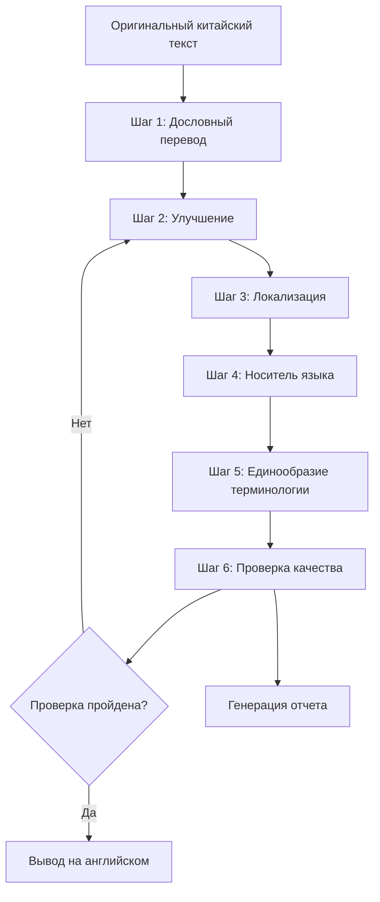

# Novel Writer Плагин перевода PRD

## 1. Обзор продукта

### 1.1 Название продукта
**Novel Writer Translate Plugin** — плагин для перевода китайских романов на английский для выхода на международный рынок.

### 1.2 Позиционирование продукта
Официальный плагин перевода для Novel Writer, разработанный специально для вывода китайских романов на международный рынок. Использует возможности языковых моделей в AI-средах (Claude Code, Cursor и т. д.) для многоэтапного процесса перевода и системы контроля качества, помогая авторам переводить свои произведения с китайского на идиоматический английский, адаптируя языковой стиль для различных платформ, таких как Medium, Reddit, Webnovel и других.

### 1.3 Статус реализации
**Базовая версия реализована**, включая основные команды перевода, команды улучшения и режим эксперта по переводу.

### 1.4 Основные преимущества
- **Перевод без затрат**: Полностью использует существующую AI-среду, не требует дополнительных API-затрат.
- **Многоэтапная оптимизация**: От дословного перевода до локализации, поэтапное улучшение качества перевода.
- **Адаптация под платформу**: Корректировка языкового стиля для различных платформ.
- **Гарантия качества**: Проверка обратным переводом и перекрестная проверка с помощью ИИ.
- **Единообразие терминологии**: Система управления именованными сущностями.

### 1.5 Философия дизайна

Основано на лучших практиках, которыми поделилось сообщество, и полностью опирается на мощные возможности AI-среды:

1. **Многократный перевод**: Дословный перевод → Улучшение → Локализация → Носитель языка.
2. **Адаптация стиля**: Корректировка способа выражения в соответствии с целевой платформой.
3. **Проверка качества**: Сравнение обратного перевода + отчет об отличиях.
4. **Профессиональное управление**: Глоссарий + поддержка контекста.

## 2. Архитектура функций

### 2.1 Реализованная система команд

```
/translate          # Базовая команда перевода (реализована)
/polish            # Команда улучшения английского текста (реализована)
/expert translate  # Режим эксперта по переводу (реализован)

# Планируемые команды:
/translate-verify   # Проверка перевода
/translate-glossary # Управление терминологией
/translate-batch    # Пакетный перевод
```

### 2.2 Блок-схема процесса перевода


```mermaid
graph TD
    A[Оригинальный китайский текст] --> B[Шаг 1: Дословный перевод]
    B --> C[Шаг 2: Улучшение]
    C --> D[Шаг 3: Локализация]
    D --> E[Шаг 4: Носитель языка]
    E --> F[Шаг 5: Единообразие терминологии]
    F --> G[Шаг 6: Проверка качества]
    G --> H{Проверка пройдена?}
    H -->|Да| I[Вывод на английском]
    H -->|Нет| C
    G --> J[Генерация отчета]
```

## 3. Детальный дизайн функций

### 3.1 Основная команда перевода `/translate`

#### 3.1.1 Шаблон команды
```markdown
---
description: Перевести главу на идиоматический английский
scripts:
  sh: .specify/plugins/translate/scripts/bash/translate.sh
  ps: .specify/plugins/translate/scripts/powershell/translate.ps1
---

## Интеллектуальный процесс перевода

### Шаг 1: Подготовка
1. Чтение содержимого текущей главы
2. Загрузка глоссария (translation/glossary.json)
3. Получение сводки предыдущего контекста (translation/context.json)
4. Подтверждение целевой платформы и стиля

### Шаг 2: Многократный перевод

#### Раунд 1: Базовый дословный перевод
"Переведи следующий китайский текст на английский, сохраняя все детали, эмоции и культурные нюансы:"
[Китайское содержимое]

#### Раунд 2: Улучшение и оптимизация
"Улучши этот английский текст, чтобы он стал более плавным и естественным, но не меняй первоначальный смысл:"
[Английское содержимое]

#### Раунд 3: Адаптация под платформу
"Перепиши этот английский текст в стиле, подходящем для платформы [Medium/Reddit/Webnovel],
чтобы американский читатель воспринял его как написанный носителем языка:"
[Английское содержимое]

#### Раунд 4: Единообразие именованных сущностей
Применение глоссария для обеспечения:
- Единообразия перевода имен персонажей
- Единообразия перевода названий мест
- Единообразия перевода специальных понятий

### Шаг 3: Управление выводом
1. Сохранение в chapters-en/[номер главы].md
2. Обновление прогресса перевода translation/progress.json
3. Генерация файла сравнения translation/compare/[номер главы].md
```

#### 3.1.2 Исполняемый скрипт
```bash
#!/usr/bin/env bash
# translate.sh

# Получение аргументов
CHAPTER_FILE=$1
TARGET_LANG=${2:-"en-US"}
PLATFORM=${3:-"medium"}

# Создание выходных каталогов
mkdir -p chapters-en
mkdir -p translation/{compare,reports}

# Вывод информации о конфигурации
echo "📚 Начинается перевод главы"
echo "Исходный файл: $CHAPTER_FILE"
echo "Целевой язык: $TARGET_LANG"
echo "Целевая платформа: $PLATFORM"

# Проверка глоссария
if [ -f "translation/glossary.json" ]; then
    echo "✅ Глоссарий загружен"
else
    echo "⚠️ Глоссарий не найден, будет создан стандартный глоссарий"
    mkdir -p translation
    echo '{"characters":{},"locations":{},"concepts":{}}' > translation/glossary.json
fi

# Возврат успеха, чтобы ИИ взял на себя процесс перевода
exit 0
```

### 3.2 Команда проверки перевода `/translate-verify`

#### 3.2.1 Процесс проверки
```markdown
## Тройной механизм проверки

### Шаги проверки

#### 1. Проверка обратным переводом
"Переведи следующий английский текст обратно на китайский:"
[Английское содержимое]

Сравнение с оригиналом, проверка:
- Полностью ли сохранены основные сведения
- Соответствует ли эмоциональная окраска
- Точен ли культурный подтекст

#### 2. Проверка носителем языка
"Представь, что ты американский читатель, оцени следующий текст:
1. Похож ли он на написанный носителем языка?
2. Есть ли неестественные моменты?
3. Требуются ли пояснения культурных концепций?"

#### 3. Генерация отчета об отличиях
| Пункт проверки | Статус | Описание |
|--------|------|------|
| Полнота информации | ✅/⚠️/❌ | Детальное описание |
| Естественность языка | ✅/⚠️/❌ | Детальное описание |
| Культурная адаптация | ✅/⚠️/❌ | Детальное описание |
| Единообразие терминологии | ✅/⚠️/❌ | Детальное описание |
```

#### 3.2.2 Шаблон отчета о проверке
```markdown
# Отчет о проверке перевода

## Информация о главе
- Глава: Глава [X] [Название]
- Количество слов в оригинале: [X]
- Количество слов в переводе: [X]
- Время перевода: [Временная метка]

## Сравнение обратного перевода

### Сравнение ключевых фрагментов
| Оригинал | Перевод | Обратный перевод | Степень отклонения |
|------|------|------|--------|
| ... | ... | ... | 95% |

### Оценка полноты информации
- Основные сюжетные моменты: ✅ Полностью сохранены
- Диалоги персонажей: ✅ Тон уместен
- Описание окружения: ⚠️ Частично упрощено
- Культурные особенности: ❌ Требуется пояснение

## Взгляд носителя языка

### Оценка естественности: 8.5/10

### Проблемные моменты:
1. Слово "cultivation" встречается слишком часто, рекомендуется заменить выражение.
2. Предложение в 3-м абзаце слишком "китайское" по структуре, рекомендуется перестроить.
3. Концепция "face" требует культурного пояснения.

### Предложения по улучшению:
[Конкретные предложения по изменению]

## Итоговая оценка
- **Общее качество**: B+
- **Рекомендации**: После небольших правок можно публиковать
```

### 3.3 Команда управления терминологией `/translate-glossary`

#### 3.3.1 Структура глоссария
```json
{
  "metadata": {
    "version": "1.0",
    "lastUpdate": "2025-09-22",
    "targetLanguage": "en-US"
  },
  "characters": {
    "李明": {
      "primary": "Li Ming",
      "alternatives": ["Ming Li", "Lee Ming"],
      "pronunciation": "Lee Ming",
      "description": "Главный герой, фамилия Ли, имя Мин",
      "firstAppearance": "chapter-1"
    },
    "苏婉儿": {
      "primary": "Su Wan'er",
      "alternatives": ["Wan'er", "Lady Su"],
      "description": "Главная героиня",
      "note": "Сохранить китайский колорит"
    }
  },
  "locations": {
    "青云山": {
      "primary": "Azure Cloud Mountain",
      "literal": "Qingyun Mountain",
      "type": "Горный хребет",
      "description": "Местонахождение секты главного героя"
    },
    "天机阁": {
      "primary": "Heavenly Secrets Pavilion",
      "literal": "Tianji Pavilion",
      "type": "Здание"
    }
  },
  "concepts": {
    "修仙": {
      "primary": "cultivation",
      "alternatives": [
        "cultivating immortality",
        "pursuing the Dao"
      ],
      "explanation": "The practice of refining one's body and spirit to achieve immortality",
      "contextual": {
        "formal": "cultivation of immortality",
        "casual": "cultivation",
        "explanatory": "the ancient art of cultivation"
      }
    },
    "灵气": {
      "primary": "spiritual energy",
      "alternatives": ["qi", "spiritual qi", "essence"],
      "usage": "Выбирать в зависимости от контекста"
    },
    "金丹": {
      "primary": "Golden Core",
      "literal": "Jindan",
      "explanation": "A crystallized energy core formed in a cultivator's dantian",
      "stage": "cultivation_level_3"
    }
  },
  "idioms": {
    "画蛇添足": {
      "primary": "gilding the lily",
      "literal": "adding feet to a snake",
      "meaning": "делать лишнее",
      "usage": "Когда персонаж делает что-то ненужное"
    },
    "狐假虎威": {
      "primary": "borrowing the tiger's might",
      "alternatives": ["false bravado"],
      "meaning": "использовать чужой авторитет"
    }
  },
  "titles": {
    "掌门": {
      "primary": "Sect Master",
      "alternatives": ["Sect Leader", "Master"],
      "usage": "В официальных случаях использовать Sect Master"
    },
    "长老": {
      "primary": "Elder",
      "context": {
        "respectful": "Honored Elder",
        "casual": "Elder [Name]"
      }
    }
  },
  "rules": {
    "nameOrder": "Китайский порядок имен (фамилия впереди)",
    "titles": "Соблюдать единообразие в титулах",
    "explanations": "Предоставлять краткое пояснение при первом появлении"
  }
}
```

#### 3.3.2 Функции управления терминологией
```markdown
## Команда управления терминологией

### Добавление термина
/translate-glossary add --type character --chinese "张三" --english "Zhang San"

### Пакетный импорт
/translate-glossary import [путь к файлу]

### Интеллектуальное извлечение
"Анализировать текущую главу, извлечь имена собственные, требующие перевода"

### Проверка на единообразие
"Проверить единообразие терминологии во всех переведенных главах"
```

### 3.4 Команда пакетного перевода `/translate-batch`

#### 3.4.1 Процесс пакетной обработки
```markdown
## Управление пакетным переводом

### Конфигурация задачи
1. Выбор диапазона глав (например: главы 1-10)
2. Установка параметров перевода
3. Настройка количества параллельных процессов (рекомендуется: 3)

### Стратегия выполнения
- Последовательный перевод: Поддерживает связность контекста
- Возобновление с точки прерывания: Поддерживает продолжение после прерывания
- Отслеживание прогресса: Отображает прогресс в реальном времени

### Контроль качества
- Общая корректура каждые 5 глав
- Автоматическая проверка единообразия терминологии
- Генерация отчета по пакету
```

### 3.5 Команда настройки стиля `/translate-style`

#### 3.5.1 Конфигурация стиля платформы
```json
{
  "medium": {
    "sentenceLength": "medium",
    "paragraphLength": "short",
    "tone": "professional",
    "vocabulary": "accessible",
    "features": [
      "Использовать подзаголовки для разделения абзацев",
      "Начинать с привлекательного вступления",
      "Заканчивать размышлениями"
    ]
  },
  "reddit": {
    "sentenceLength": "varied",
    "tone": "casual",
    "vocabulary": "colloquial",
    "features": [
      "Использовать распространенные выражения Reddit",
      "Умеренно использовать сетевой сленг",
      "Поддерживать диалоговый стиль"
    ]
  },
  "webnovel": {
    "sentenceLength": "short",
    "tone": "dramatic",
    "vocabulary": "simple",
    "features": [
      "Быстрый темп повествования",
      "Использовать короткие предложения для создания напряжения",
      "Заканчивать главы на интригующей ноте"
    ]
  },
  "royalroad": {
    "tone": "immersive",
    "vocabulary": "fantasy-oriented",
    "features": [
      "Подробное описание мира",
      "Систематическое объяснение способностей",
      "Прогрессия роста, основанная на данных"
    ]
  }
}
```

### 3.6 Команда управления контекстом `/translate-context`

#### 3.6.1 Поддержка контекста
```json
{
  "currentChapter": 15,
  "previousSummary": "Главный герой только что достиг стадии Золотого Ядра...",
  "characterStatus": {
    "李明": {
      "level": "Golden Core Stage",
      "location": "Azure Cloud Mountain",
      "relationship": {
        "苏婉儿": "mutual affection developing"
      }
    }
  },
  "ongoingPlots": [
    "Поиск пропавшего учителя",
    "Расследование заговора демонического культа"
  ],
  "foreshadowing": [
    {
      "chapter": 10,
      "element": "Таинственный нефритовый кулон",
      "status": "unresolved"
    }
  ]
}
```

## 4. Техническая реализация

### 4.1 Структура реального плагина

```
plugins/translate/
├── config.yaml           # Конфигурация плагина (реализована)
├── commands/             # Каталог команд (реализован)
│   ├── translate.md     # Команда перевода
│   └── polish.md        # Команда улучшения
└── experts/              # Каталог экспертов (реализован)
    └── translate.md      # Эксперт по переводу
```

### 4.2 Основной движок перевода

```javascript
class TranslationEngine {
  constructor(aiEnvironment) {
    this.ai = aiEnvironment; // Среда Claude/Cursor и т. д.
    this.glossary = new GlossaryManager();
    this.context = new ContextManager();
  }

  async translate(text, options = {}) {
    const { platform = 'medium', style = 'default' } = options;

    // Многоэтапный процесс перевода
    let result = text;

    // Шаг 1: Дословный перевод
    result = await this.directTranslate(result);

    // Шаг 2: Улучшение
    result = await this.polish(result);

    // Шаг 3: Локализация
    result = await this.localize(result, platform);

    // Шаг 4: Единообразие терминологии
    result = await this.applyGlossary(result);

    return result;
  }

  async directTranslate(text) {
    const prompt = `Translate the following Chinese text to English, preserving all details and emotions:\n\n${text}`;
    return await this.ai.complete(prompt);
  }

  async polish(text) {
```
    const prompt = `Polish this English text to make it more natural and fluent, without changing the meaning:\n\n${text}`;
    return await this.ai.complete(prompt);
  }

  async localize(text, platform) {
    const styleGuide = this.getStyleGuide(platform);
    const prompt = `Rewrite this text in the style of ${platform} content, as if written by a native English speaker:\n\nStyle guide: ${styleGuide}\n\nText: ${text}`;
    return await this.ai.complete(prompt);
  }

  async applyGlossary(text) {
    const terms = await this.glossary.getTerms();
    // 应用术语替换逻辑
    return this.glossary.apply(text, terms);
  }
}
```

### 4.3 Система проверки качества

```javascript
class QualityChecker {
  async verify(original, translated) {
    const checks = {
      backTranslation: await this.backTranslate(translated),
      nativeCheck: await this.checkNaturalness(translated),
      completeness: await this.checkCompleteness(original, translated),
      consistency: await this.checkConsistency(translated)
    };

    return this.generateReport(checks);
  }

  async backTranslate(text) {
    const prompt = `Translate this English text back to Chinese:\n\n${text}`;
    const result = await this.ai.complete(prompt);
    return result;
  }

  async checkNaturalness(text) {
    const prompt = `As an American reader, rate how natural this text sounds (1-10) and list any unnatural expressions:\n\n${text}`;
    return await this.ai.complete(prompt);
  }

  generateReport(checks) {
    return {
      score: this.calculateScore(checks),
      issues: this.extractIssues(checks),
      suggestions: this.generateSuggestions(checks)
    };
  }
}
```

## 5. Пользовательский интерфейс

### 5.1 Первый запуск

```
Пользователь: /translate
AI: Обнаружено первое использование функции перевода, требуется инициализация настроек:

1. Целевая платформа? (Medium/Reddit/Webnovel/RoyalRoad)
Пользователь: Medium

2. Есть ли существующий глоссарий? (Y/N)
Пользователь: N

AI: Создана конфигурация по умолчанию. Начинается анализ текущей главы...

[AI выполняет процесс перевода]

AI: Перевод завершен!
- Оригинал: 3000 слов
- Перевод: 1856 слов
- Оценка качества: 8.7/10
- Место сохранения: chapters-en/chapter-001.md

Хотите просмотреть отчет о проверке?
```

### 5.2 Управление глоссарием

```
Пользователь: /translate-glossary

AI: Управление глоссарием:
1. Просмотреть текущие термины (23)
2. Добавить новый термин
3. Пакетный импорт
4. Интеллектуальное извлечение
5. Экспорт глоссария

Выберите действие (1-5):

Пользователь: 4

AI: Анализ последней главы для извлечения специальных терминов...

Обнаружены следующие новые термины:
1. 天元剑法 - Предлагаемый перевод: Heavenly Origin Sword Technique
2. 百花谷 - Предлагаемый перевод: Hundred Flowers Valley
3. 灵兽 - Предлагаемый перевод: Spirit Beast

Добавить в глоссарий? (Y/N)
```

### 5.3 Пакетный перевод

```
Пользователь: /translate-batch 1-10

AI: Подготовка к пакетному переводу глав 1-10

Подтверждение конфигурации:
- Диапазон глав: 1-10
- Целевая платформа: Medium
- Ориентировочное время: 30 минут
- Глоссарий: Загружен (45 терминов)

Начать перевод? (Y/N)

Пользователь: Y

AI: Начинается пакетный перевод...
[■■■□□□□□□□] 30% - Перевод главы 3
Завершено: 2 главы
Текущая: Глава 3 - Первое знакомство с горой
Осталось: 7 глав
Ориентировочное оставшееся время: 21 минута
```

## 6. Хранение данных

### 6.1 Организация файлов

```
novel-project/
├── stories/my-story/
│   ├── chapters/           # Оригиналы на китайском
│   │   ├── chapter-001.md
│   │   └── ...
│   ├── chapters-en/        # Переводы на английский
│   │   ├── chapter-001.md
│   │   └── ...
│   └── translation/        # Данные перевода
│       ├── glossary.json   # Глоссарий
│       ├── context.json    # Контекст
│       ├── style.json      # Настройки стиля
│       ├── progress.json   # Отслеживание прогресса
│       ├── compare/        # Файлы сравнения
│       │   └── chapter-001-compare.md
│       └── reports/        # Отчеты о проверке
│           └── chapter-001-report.md
```

### 6.2 Отслеживание прогресса

```json
{
  "totalChapters": 240,
  "translatedChapters": 15,
  "lastTranslated": "chapter-015",
  "lastTranslatedTime": "2025-09-22T10:30:00Z",
  "statistics": {
    "totalSourceWords": 45000,
    "totalTranslatedWords": 28500,
    "averageQualityScore": 8.6,
    "timeSpent": "12:30:00"
  },
  "chapters": {
    "chapter-001": {
      "status": "completed",
      "quality": 8.9,
      "wordCount": 1856,
      "translatedAt": "2025-09-20T10:00:00Z",
      "lastModified": "2025-09-21T15:30:00Z"
    }
  }
}
```

## 7. Оптимизация производительности

### 7.1 Кэширование перевода
- Кэширование переведенных фрагментов
- Кэширование часто используемых выражений
- Кэширование результатов проверки

### 7.2 Инкрементальный перевод
- Перевод только измененных частей
- Сохранение неизмененного контента
- Интеллектуальное обнаружение изменений

### 7.3 Параллельная обработка
- Параллельный перевод на уровне фрагментов
- Пакетная проверка
- Асинхронная генерация отчетов

## 8. Обеспечение качества

### 8.1 Автоматизированное тестирование
- Тестирование согласованности терминологии
- Тестирование точности обратного перевода
- Тестирование соответствия стилю

### 8.2 Интерфейс ручной проверки
```markdown
## Режим проверки

Экспорт результатов перевода в формате сравнения для облегчения ручной проверки:

| Оригинал | Машинный перевод | Предлагаемые изменения | Окончательный вариант |
|------|------|----------|--------|
| ... | ... | [Редактируемый] | [Подтвердить] |
```

### 8.3 Управление версиями
- Сохранение версий при каждом переводе
- Поддержка сравнения версий
- Поддержка отката версий

## 9. Расширенные функции

### 9.1 Интеграция голосового чтения
- Генерация аудиофайлов
- Выбор голоса
- Регулировка скорости речи

### 9.2 Экспорт в электронные книги
- Формат EPUB
- Формат PDF
- Формат Kindle

### 9.3 Прямая публикация на платформах
- Интеграция с Medium API
- Автоматическая публикация на Reddit
- Загрузка на Webnovel

## 10. Метрики успеха

### 10.1 Показатели качества
- Средняя оценка качества > 8.5/10
- Согласованность терминологии > 99%
- Удовлетворенность пользователей > 90%

### 10.2 Показатели эффективности
- Скорость перевода > 2000 слов/10 минут
- Уровень доработок < 5%
- Уровень автоматизации > 95%

### 10.3 Показатели использования
- Ежемесячно активные пользователи > 1000
- Общий объем переведенных слов > 10 миллионов
- Успешно опубликованных за рубежом произведений > 50

## 11. Дорожная карта развития

### Фаза 1: MVP-версия (4 недели)
- Базовая функция перевода
- Управление глоссарием
- Проверка качества

### Фаза 2: Расширенная версия (4 недели)
- Пакетная обработка
- Настройка стиля
- Управление контекстом

### Фаза 3: Профессиональная версия (8 недель)
- Поддержка нескольких языков
- Интеграция API платформ
- Функции командной работы

---

**Версия документа**: v1.0
**Дата создания**: 2025-09-22
**Автор**: Novel Writer Team
**Статус**: Ожидает рассмотрения