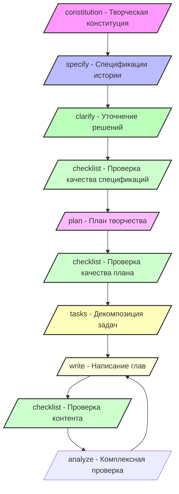

```markdown
# Руководство по процессу творчества

Это руководство подробно описывает полный процесс создания романа с использованием Novel Writer. Novel Writer опирается на методологию Spec-Kit и применяет концепцию разработки, управляемой спецификациями (SDD), в области творчества.

## Основные концепции

### Творчество, управляемое спецификациями (Spec-Driven Writing)

Опираясь на методологию SDD от Spec-Kit, Novel Writer использует многоуровневый поэтапный режим творчества:

1. **Определение спецификаций**: Сначала определяются общие спецификации произведения (стиль, тема, структура).
2. **Планирование**: Спецификации детализируются в выполнимый план творчества.
3. **Декомпозиция задач**: План разбивается на конкретные творческие задачи.
4. **Итеративная реализация**: Каждая задача постепенно реализуется с постоянным итеративным улучшением.

## Обзор творческого процесса



## Этап 1: Подготовительная работа

### 1.1 Подготовка среды

```bash
# Установка инструментов
npm install -g novel-writer-cn

# Создание проекта
novel init Мой роман

# Вход в проект
cd Мой роман
```

### 1.2 Выбор AI-помощника

Выберите подходящего AI-помощника в соответствии с вашими потребностями:

| AI-помощник | Преимущества | Сценарии использования |
|-------------|--------------|-----------------------|
| Claude      | Сильное понимание, высокое качество творчества | Произведения с сильным литературным уклоном |
| Cursor      | Интегрированная среда разработки, высокая эффективность | Творчество, требующее частых правок |
| Gemini      | Широкий кругозор, богатое воображение | Научная фантастика, фэнтези |

### 1.3 Понимание структуры проекта

Опираясь на организацию Spec-Kit, Novel Writer использует четкую многоуровневую структуру:

```
Мой роман/
├── templates/         # Шаблоны команд (по аналогии со spec-kit)
│   └── commands/      # Различные команды для творчества
├── memory/            # Память творчества (стиль, сеттинг)
│   ├── constitution.md # Творческая конституция
│   └── style.md       # Правила стиля
├── specs/             # Сгенерированные произведения (по аналогии со spec-kit)
│   └── 001-Название романа/
│       ├── spec.md    # Спецификации истории
│       ├── plan.md    # План творчества
│       ├── tasks.md   # Список задач
│       ├── chapters/  # Содержание глав
│       ├── characters/# Настройки персонажей
│       └── worldbuilding/ # Мироустройство
└── scripts/           # Вспомогательные скрипты
    ├── bash/          # Bash скрипты
    └── powershell/    # PowerShell скрипты
```

## Этап 2: Планирование творчества

### 2.1 Создание творческой конституции (/constitution)

Творческая конституция — это высший принцип творчества, который необходимо четко определить:

#### Основные настройки
- **Стиль**: Веб-роман / Литературный / Легкий роман
- **Перспектива повествования**: Первое лицо / Третье лицо / Всеведущий рассказчик
- **Выбор времени**: Прошедшее / Настоящее
- **Целевая аудитория**: Возраст, пол, читательские предпочтения

#### Правила письма
- **Длина главы**: Диапазон слов на главу
- **Частота обновлений**: Ежедневно / Еженедельно / Нерегулярно
- **Стиль языка**: Формальный / Разговорный / Сетевой
- **Акцент описания**: Действия / Психология / Окружение / Диалоги

#### Пример настроек

```text
/constitution
【Основные ценности】
- История передает позитивную энергию и рост
- Подчеркивается важность усилий и интеллекта

【Стандарты качества】
- Каждая глава должна продвигать сюжет
- Действия персонажей должны соответствовать их характеру
- Мироустройство должно быть логически последовательным

【Стиль творчества】
- Стиль: Веб-роман, с акцентом на «крутость»
- Перспектива: Ограниченное третье лицо
- Язык: Простой и понятный, с быстрым темпом

【Правила контента】
- 3000-4000 слов на главу
- Избегать чрезмерного описания насилия
- Не затрагивать чувствительные темы
```

### 2.2 Определение спецификаций истории (/specify)

Определите спецификации истории, как менеджер продукта пишет PRD:

#### Основные настройки
1. **Краткое описание**: Опишите свою историю одним предложением.
2. **Основной конфликт**: Основная проблема, с которой сталкивается главный герой.
3. **Тема**: Ценности, которые вы хотите передать.

#### Настройки персонажей
1. **Настройки главного героя**
   - Основная информация (имя, возраст, профессия)
   - Черты характера
   - Дуга развития
   - Основная мотивация

2. **Важные второстепенные персонажи**
   - Отношения с главным героем
   - Роль в истории
   - Индивидуальные особенности

#### Настройки мироустройства
1. **Исторический фон**
2. **Географическая среда**
3. **Социальные правила**
4. **Система сил** (если есть)

#### Структура сюжета
Используйте классическую трехактную структуру или структуру «завязка-развитие-кульминация-развязка»:

1. **Завязка** (1-25%)
   - Создание мироустройства
   - Представление главного героя
   - Введение конфликта

2. **Развитие** (25-75%)
   - Эскалация конфликта
   - Развитие персонажа
   - Изменение отношений

3. **Кульминация и финал** (75-100%)
   - Финальное противостояние
   - Решение проблемы
   - Завершение

### 2.3 Уточнение ключевых решений (/clarify)

AI выявит неясные моменты в спецификациях и задаст 5 уточняющих вопросов:

```text
/clarify
AI: Я обнаружил следующие ключевые моменты, требующие уточнения:
1. Является ли «золотой палец» главного героя системой или наследием?
2. Будет ли темп истории быстрым, как в «крутых» романах, или медленным и постепенным?
3. Будет ли в истории одна главная героиня или несколько?
...
```

### 2.4 Проверка качества спецификаций (/checklist)

После завершения уточнения спецификаций используйте `/checklist 完整性` для проверки качества документа:

1. **Запустите команду**: `/checklist 完整性`, чтобы проверить полноту, отслеживаемость и согласованность `spec/specification.md`.
2. **Определите проблемы**: Checklist выведет непокрытые разделы, неясные описания и точки конфликта, сохранив их в каталоге `spec/checklists/`.
3. **Исправьте и повторите проверку**: Итеративно улучшайте документ спецификаций на основе списка проблем, пока checklist не будет пройден полностью.

Этот шаг гарантирует, что последующее планирование и написание будут основаны на надежном документе спецификаций.

### 2.5 Составление плана творчества (/plan)

Составьте план технической реализации на основе уточненных спецификаций:

#### Принципы планирования
1. **Контроль темпа**
   - Сбалансированное чередование напряженных и спокойных моментов
   - Разумное распределение кульминаций
   - Грамотное создание интриги

2. **Четкость функций**
   - Каждая глава должна продвигать сюжет
   - Избегайте «водянистых» глав
   - Умеренное количество информации

3. **Последовательность**
   - Четкая логика между главами
   - Соответствие завязок и развязок
   - Четкая временная линия

#### Шаблон плана

```text
/plan
【Том 1: Деревня новичков】 (Главы 1-30)

Главы 1-3: Вступление
- Глава 1: Пролог, демонстрация затруднительного положения главного героя
- Глава 2: Поворотный момент, получение «золотого пальца»
- Глава 3: Первый опыт использования, первые успехи

Главы 4-10: Период исследования
- Главы 4-6: Изучение способностей, составление плана
- Главы 7-8: Первая небольшая цель
- Главы 9-10: Первая победа, укрепление уверенности

Главы 11-20: Период роста
- Главы 11-13: Возникновение препятствий, появление давления
- Главы 14-16: Поиск прорыва, получение помощи
- Главы 17-18: Преодоление кризиса, повышение силы
- Главы 19-20: Этапная победа

Главы 21-30: Период прорыва
- Главы 21-23: Более серьезные испытания
- Главы 24-26: Испытание на грани жизни и смерти
- Главы 27-29: Контратака в безвыходной ситуации
- Глава 30: Кульминация первого тома, прорыв в уровне
```

### 2.6 Декомпозиция задач (/tasks)

Преобразуйте планирование глав в выполнимые задачи:

#### Типы задач
1. **Задачи по написанию**
   - Создание конкретных глав
   - Описание сцен
   - Написание диалогов

2. **Задачи по настройке**
   - Углубление персонажей
   - Дополнение мироустройства
   - Уточнение правил системы

3. **Задачи по редактированию**
   - Проверка логики
   - Обеспечение единообразия стиля
   - Исправление опечаток

#### Установка приоритетов
- **P0 Срочно**: Ключевые главы, влияющие на основной сюжет
- **P1 Важно**: Важные второстепенные персонажи или настройки
- **P2 Обычные**: Главы, нормально продвигающие сюжет
- **P3 Дополнительные**: Контент «для красоты»

## Этап 3: Создание контента

### 3.1 Написание глав (/write)

#### Подготовка перед написанием
1. **Обзор предыдущего контента**
   - Проверка последовательности сюжета
   - Подтверждение сюжетных завязок
   - Подсчет состояния персонажей

2. **Определение цели текущей главы**
   - Какой сюжет нужно продвинуть
   - Какую информацию нужно раскрыть
   - Какую интригу нужно создать

#### Ключевые моменты написания
1. **Привлекательное начало**
   - Связь с предыдущей главой
   - Быстрое погружение в действие
   - Создание крючка

2. **Развитие в середине**
   - Продвижение основного сюжета
   - Углубление персонажей
   - Умеренное количество информации

3. **Искусство концовки**
   - Разумное завершение
   - Оставление интриги
   - Создание задела для следующей главы

#### Пример команды для написания

```text
/write Глава 5: Первое проявление силы

Основные моменты главы:
1. Главный герой демонстрирует необычные способности в компании.
2. Это привлекает внимание главной героини.
3. Задел на появление враждебных сил.

Конкретные сцены:
- Начало: Техническая проблема на утреннем совещании.
- Развитие: Главный герой легко решает проблему, шокируя коллег.
- Поворот: Главная героиня расспрашивает его наедине.
- Концовка: Таинственный телефонный звонок, упоминающий имя главного героя.

Примечания:
- Не раскрывать слишком много способностей.
- Диалоги должны соответствовать рабочей обстановке.
- Сохранять скромный образ главного героя.
```

### 3.2 Периодическая проверка качества (/checklist)

Регулярно запускайте команду `/checklist` в соответствии с ритмом написания, чтобы поддерживать качество контента:

1. **В середине процесса написания**: После завершения каждых 5-10 глав выполняйте проверки, такие как `/checklist 人物一致性 1-10` (согласованность персонажей 1-10) или `/checklist 情节逻辑 1-20` (логика сюжета 1-20), чтобы проверить персонажей, сюжет и временную линию.
2. **Целевые проверки**: В зависимости от обнаруженных проблем выбирайте специализированные чек-листы, такие как `/checklist 世界观一致性` (согласованность мироустройства) или `/checklist 对话风格` (стиль диалогов).
3. **Отслеживание проблем**: Результаты Checklist сохраняются в `spec/checklists/`. После исправления глав, на которые указывают результаты, снова запустите команду.

Периодический контроль с помощью Checklist позволяет выявить структурные и настроечные отклонения еще до официального анализа.

### 3.3 Проверка качества (/analyze)

Проводите комплексную проверку каждые 5 глав:

```text
/analyze
Проверка по семи аспектам:
1. Соответствие — соответствует ли конституции
2. Согласованность — логически ли последовательно
3. Полнота — степень выполнения задач
4. Качество — оценка качества текста
5. Инновационность — выявление ярких моментов
6. Читабельность — проверка плавности
7. Осуществимость — оценка прогресса
```

### 3.4 Управление персонажами

#### Карточки персонажей
Создайте подробные карточки для каждого важного персонажа:

```markdown
# Персонаж: Линь Юйцин

## Основная информация
- Возраст: 24 года
- Профессия: Менеджер по продукту
- Внешность: Длинные волосы до пояса, изящная и милая

## Черты характера
- Серьезная и ответственная, стремится к совершенству
- Внешне холодная, но внутри теплая, ценит отношения
- Сильное любопытство, любит исследовать

## Предыстория
- Выпускница престижного университета
- Обычная семья, добилась всего сама
- Был неудачный прошлый роман

## Особенности речи
- Говорит кратко и по делу
- Иногда использует сетевые выражения
- В гневе неосознанно говорит на диалекте

## Траектория развития
1. Начальный этап: Обычный офисный работник
2. Средний этап: Пробуждение особой конституции
3. Поздний этап: Становится важной помощницей
```

#### Диаграмма отношений персонажей
Поддерживайте сеть отношений между персонажами:


### 3.5 Построение мироустройства

#### Документы с настройками
Создайте подробные документы с описанием мироустройства:

1. **Система сил**
   ```
   Уровни культивации:
   - Фаза очищения ци (1-9 уровней)
   - Фаза заложения основ (ранняя, средняя, поздняя)
   - Фаза золотого ядра (ранняя, средняя, поздняя)
   - Фаза зарождения души (ранняя, средняя, поздняя)
   ```

2. **Организации и фракции**
   ```
   Праведные силы:
   - Особый отдел Китая
   - Альянс древних боевых семей

   Нейтральные:
   - Рынок черной торговли
   - Разведывательные организации

   Злодейские силы:
   - Клан Черного Дракона
   - Инопланетные злые культиваторы
   ```

3. **Особые правила**
   ```
   Ограничения на культивацию в городе:
   - Нельзя проявлять себя перед обычными людьми
   - Духовная энергия разрежена, культивация затруднена
   - Контроль со стороны современных технологий
   ```

## Этап 4: Редактирование и доработка

### 4.1 Самопроверка

#### Чек-лист
- [ ] Логика сюжета последовательна?
- [ ] Характеры персонажей последовательны?
- [ ] Сюжетные завязки раскрыты?
- [ ] Темп подходящий?
- [ ] Есть ли явные грубые ошибки?

### 4.2 Редактирование с помощью AI

```text
Помоги мне проверить контент глав 10-15:
1. Разумна ли временная линия?
2. Соответствуют ли диалоги персонажам?
3. Есть ли логические пробелы?
4. Есть ли опечатки в тексте?
```

### 4.3 Обработка отзывов читателей

Собирайте и анализируйте отзывы читателей:
1. Предложения по сюжету
2. Предпочтения персонажей
3. Ощущения от темпа
4. Ожидаемые направления

## Этап 5: Управление публикацией

### 5.1 Контроль версий

Используйте Git для управления версиями:

```bash
# Ежедневные коммиты
git add .
git commit -m "Завершена глава X"

# Создание ветки для релиза
git branch release-v1
git checkout release-v1

# Отметка важных версий
git tag v1.0-Завершено
```

### 5.2 Публикация на разных платформах

Подготовьте форматы для разных платформ:
1. Веб-платформы: Публикация по главам
2. Электронные книги: Форматы EPUB/MOBI
3. Печатные издания: Форматы Word/PDF

### 5.3 План обновлений

Составьте план устойчивых обновлений:
1. Ежедневные обновления: В фиксированное время каждый день
2. Запас глав: Поддерживайте запас из 3-5 глав
3. Уведомление об отпуске: Заранее уведомляйте читателей
```
```markdown
## Продвинутые техники

### Многолинейное повествование
Управление несколькими сюжетными линиями:
1. Основная линия: рост главного героя
2. Второстепенная линия: развитие отношений
3. Скрытая линия: закулисные силы

### Изображение множества персонажей
Баланс нескольких важных персонажей:
1. Смена точек зрения (POV)
2. События с участием группы
3. Взаимодействие персонажей

### Управление завязками (предзнаменованиями)
Используйте таблицу для отслеживания завязок:

| Глава | Содержание завязки | Глава с разрешением | Статус |
|------|-------------------|--------------------|--------|
| Глава 3 | Таинственный нефритовый кулон | Глава 25 | Ожидает разрешения |
| Глава 7 | Человек в чёрном | Глава 15 | Разрешено |
| Глава 12 | Пророческая поэма | Глава 40 | Ожидает разрешения |

## Решение распространённых проблем

### В: Как преодолеть писательский блок?

**Решение**:
1. Просмотрите план, подтвердите направление.
2. Пропустите сложные главы, пишите дальше.
3. Смените обстановку для письма.
4. Обсудите с ИИ возможные сюжетные повороты.

### В: Как поддерживать ежедневную публикацию?

**Рекомендации**:
1. Выделите фиксированное время для письма.
2. Планируйте сюжет заранее.
3. Держите в запасе 3-5 глав.
4. Используйте технику «Помидора».

### В: Как повысить качество письма?

**Методы**:
1. Читайте больше отличных произведений.
2. Попросите ИИ проанализировать ваш стиль письма.
3. Регулярно просматривайте и редактируйте.
4. Прислушивайтесь к отзывам читателей.

## Рекомендуемые инструменты для творчества

### Программное обеспечение для письма
- **Typora**: Редактор Markdown
- **VS Code**: Мощный текстовый редактор
- **Scrivener**: Профессиональное ПО для письма

### Вспомогательные инструменты
- **XMind**: Интеллект-карты
- **Notion**: Управление знаниями
- **Pinterest**: Визуальные материалы

### Справочные ресурсы
- **Qidian Chinese Network**: Тенденции веб-роматов
- **Douban Books**: Справочник по книжным рецензиям
- **Zhihu**: Опыт письма

## Заключение

Novel Writer обеспечивает полную поддержку рабочего процесса создания романа, предлагая соответствующие инструменты и методы для каждого этапа — от зарождения идеи до публикации. Помните:

1. **Настойчивость — ключ к успеху** — постоянное творчество важнее совершенства.
2. **Используйте ИИ-помощника** — пусть ИИ станет вашим партнёром в творчестве.
3. **Продолжайте учиться** — постоянно совершенствуйте свои писательские навыки.
4. **Наслаждайтесь процессом** — само творчество является величайшим удовольствием.

Желаем вам успешного творчества и написания захватывающих историй!

---

[Вернуться на главную](index.md) | [Краткое руководство](quickstart.md) | [Руководство по установке](installation.md)
```